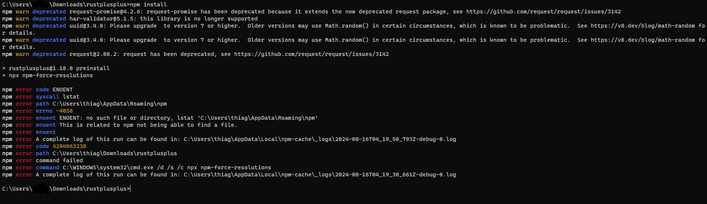
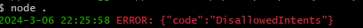
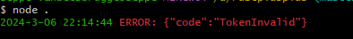
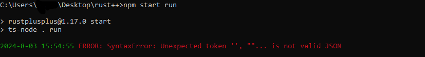
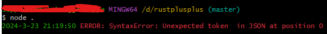
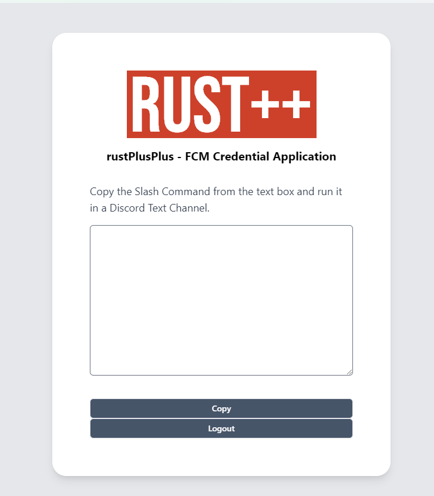

# Frequently Asked Questions
- [When I run 'npm install' I get an error](#when-i-run-npm-install-i-get-an-error)
- [I've added the credentials but when I pair I get no notification](#credentials-added-but-no-pair-notification)
- [The bot keep resetting channel permissions after restart](#bot-reset-channel-permissions)
- [Im getting 'ERROR: {"code":"DisallowedIntents"}' when trying to start the bot](#disallowed-intents)
- [Im getting 'ERROR: {"code": "TokenInvalid"}' when trying to start the bot](#token-invalid)
- [Im getting 'ERROR: SyntaxError: Unexpected token '', ""... is not valid JSON' or 'ERROR: SyntaxError: Unexpected token in JSON at position 0' when trying to start the bot](#unexpected-token-invalid-json)
- [When trying to get my credentials from the app, it's completely empty](#credential-app-empty)

## When I run 'npm install' I get an error

If you're getting the error below, try running `npm i -g npm`. This should allow you to successfully do `npm install` afterwards.

## I've added the credentials but when I pair I get no notification

If you're having trouble getting a pair notifications (server/smart device), several things can be causing this. It's possible that the credentials you are currently using have been outdated, when generating credentials, they usually last for two weeks, so you can try to re-generate them through the [rustplusplus credential application](https://github.com/alexemanuelol/rustplusplus-credential-application) or the [rustplusplus website](https://rustplusplus-credentials.netlify.app/).

If you're still not getting any notifications and you are simultaneously using the rust companion app and are successfully getting pairing notifications there, this could be the issue. While it's possible to run both apps at the same time, it's not recommended. The reason for this is that using the same steam account credentials in different places makes the notifications a bit unstable, some notifications might still get through. In the scenario of trying to pair a server or a smart device, you can just try doing several attempts of pairing and eventually it will get through.

## The bot keep resetting channel permissions after restart

This is intentional. While this might change in the future, the current solution for this is to use the /role command to set a specific role that will be allowed to view the channels.

## Im getting 'ERROR: {"code":"DisallowedIntents"}' when trying to start the bot

If you're getting this error it's because you missed a step in the setup guide (Step 9). Kick the bot from your discord server and go [here](https://github.com/alexemanuelol/rustplusplus/blob/master/docs/discord_bot_setup.md) and follow the guide from step 9.

## Im getting 'ERROR: {"code": "TokenInvalid"}' when trying to start the bot

This happens when the token you placed in the config file is invalid. There have been cases where people clone the repository with git and also download the zip of the repository, ending having two separate repositories of the bot. The problem that have occured for these people is that they've placed the token in one respository and tried running the other one. So make sure that you are trying to start the correct bot that have the config setup with the token.

## Im getting 'ERROR: SyntaxError: Unexpected token '', ""... is not valid JSON' when trying to start the bot

This occurs for some people when their PC crash, there is still no solution for this but I hope to solve this in the future. Meanwhile you can follow the [issue on GitHub](https://github.com/alexemanuelol/rustplusplus/issues/309) for updates. Current solution to be able to continue is to remove your instance file and let the bot create a new one when you start the bot next time.

## When trying to get my credentials from the app, it's completely empty

If the rustplusplus credential application looks like the image below after you've logged in with your steam details this might be because of where you live or something else blocking you from generating. The solution for you would be to try it on the [rustplusplus website](https://rustplusplus-credentials.netlify.app/) instead.

