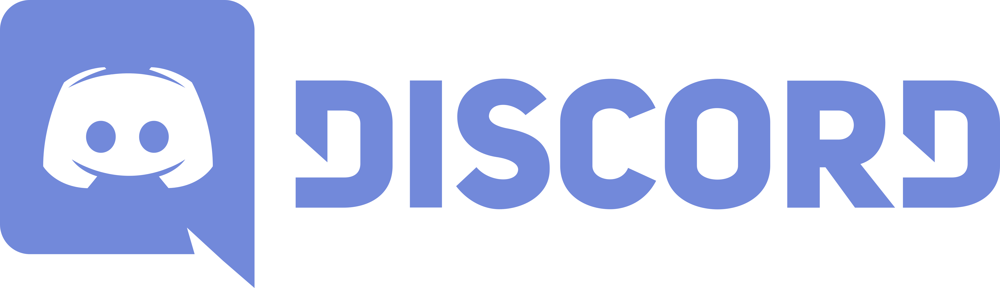

</a>

    

<h1 align="center"><em><b>rustplusplus</b> ~ Rust+ Discord Bot</em></h1>

A NodeJS Discord Bot that uses the [rustplus.js](https://github.com/liamcottle/rustplus.js) library to utilize the power of the [Rust+ Companion App](https://rust.facepunch.com/companion) with additional Quality-of-Life features.

## **How-to Setup Video**

## **Features**

* Receive notifications for [In-Game Events](docs/discord_text_channels.md#events-channel) (Patrol Helicopter, Cargo Ship, Chinook 47, Oil Rigs triggered).
* Control [Smart Switches](docs/smart_devices.md#smart-switches) or Groups of Smart Switches via Discord or In-Game Team Chat.
* Setup [Smart Alarms](docs/smart_devices.md#smart-alarms) to notify in Discord or In-Game Team Chat whenever they are triggered.
* Use [Storage Monitors](docs/smart_devices.md#storage-monitors) to keep track of Tool Cupboard Upkeep or Large Wooden Box/Vending Machine content.
* Head over to the [Information Text Channel](docs/images/information_channel.png) to see all sorts of information about the server, ongoing events and team member status.
* Communicate with teammates from [Discord to In-Game](docs/discord_text_channels.md#teamchat-channel) and vice versa.
* Keep track of other teams on the server with the [Battlemetrics Player Tracker](docs/discord_text_channels.md#trackers-channel).
* Alot of [QoL Commands](docs/commands.md) that can be used In-Game or from Discord.
* View the [Full list of features](docs/full_list_features.md).

## **Documentation**

> Documentation can be found [here](https://github.com/alexemanuelol/rustplusplus/blob/master/docs/documentation.md). The documentation explains the features as well as `how to setup the bot`, so make sure to take a look at it 😉

## **Credentials**

> You can get your credentials by running the `rustplusplus credential application`. Download it [here](https://github.com/alexemanuelol/rustplusplus-credential-application/releases/download/v1.4.0/rustplusplus-1.4.0-win-x64.exe)

## **How to run the bot**

> To run the bot, simply open the terminal of your choice and run the following from repository root:

    $ npm start run

## **How to update the repository**

> Depending on your OS / choice of terminal you can run:

    $ update.bat

or

    $ ./update.sh

## **Running via docker**

    $ docker run --rm -it -v ${pwd}/credentials:/app/credentials -v ${pwd}/instances:/app/instances -v ${pwd}/logs:/app/logs -e RPP_DISCORD_CLIENT_ID=111....1111 -e RPP_DISCORD_TOKEN=token --name rpp ghcr.io/alexemanuelol/rustplusplus

or

    $ docker-compose up -d

Make sure you use the correct values for DISCORD_CLIENT_ID as well as DISCORD_TOKEN in the docker command/docker-compose.yml

## **Thanks to**

**liamcottle**@GitHub - for the [rustplus.js](https://github.com/liamcottle/rustplus.js) library.
 
**.Vegas.#4844**@Discord - for the awesome icons!
