# Commands Documentation

> Commands can be executed via Discord or In-Game Team Chat. To be able to run Slash Commands in Discord, you need to be part of the designated Discord Role for the bot. If no role is set for the bot then everyone should be able to use the Slash Commands by default. To be able to run In-Game Commands, you need to be in the same In-Game Team as the person who setup the FCM credentials. In-Game Commands can only be run from Team Chat, not global chat.

- [Discord Slash Commands](commands.md#discord-slash-commands)
- [In-Game Commands](commands.md#in-game-commands)

# Discord Slash Commands

Slash Command | Description
------------- | -----------
[**/alarm**](commands.md#alarm) | Operations on Smart Alarms.
[**/credentials**](commands.md#credentials) | Set/Clear the FCM Credentials for the user account.
[**/customizetimers**](commands.md#customizetimers) | Operations to customize In-Game timers.
[**/help**](commands.md#help) | Display help message.
[**/leader**](commands.md#leader) | Give or take the leadership from/to a team member.
[**/map**](commands.md#map) | Get the currently connected server map image.
[**/market**](commands.md#market) | Operations for In-Game Vending Machines.
[**/players**](commands.md#players) | Get player/players information based on battlemetrics.
[**/reset**](commands.md#reset) | Reset Discord channels.
[**/role**](commands.md#role) | Set/Clear a specific role that will be able to see the rustPlusPlus category content.
[**/storagemonitor**](commands.md#storagemonitors) | Operations on Storage Monitors.
[**/switch**](commands.md#switch) | Operations on Smart Switches.
[**/tracker**](commands.md#tracker) | Operations for Battlemetrics Player Tracker.

## **/alarm**

> **Operations on Smart Alarms.**

Subcommand | Options | Description | Required
---------- | ------- | ----------- | --------
`edit` | &nbsp; | Edit the properties of a Smart Alarm. | &nbsp;
&nbsp; | `id` | The ID of the Smart Alarm. | `True`
&nbsp; | `image` | Set the image that best represent the Smart Alarm. | `True`

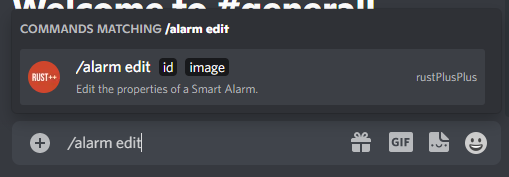

## **/credentials**

> **Set/Clear the FCM Credentials for the user account.**

Subcommand | Options | Description | Required
---------- | ------- | ----------- | --------
`set` | &nbsp; | Set the FCM Credentials. | &nbsp;
&nbsp; | `keys_private_key` | Keys Private Key. | `True`
&nbsp; | `keys_public_key` | Keys Public Key. | `True`
&nbsp; | `keys_auth_secret` | Keys Auth Secret. | `True`
&nbsp; | `fcm_token` | FCM Token. | `True`
&nbsp; | `fcm_push_set` | FCM Push Set. | `True`
&nbsp; | `gcm_token` | GCM Token. | `True`
&nbsp; | `gcm_android_id` | FCM Android ID. | `True`
&nbsp; | `gcm_security_token` | GCM Security Token. | `True`
&nbsp; | `gcm_app_id` | GCM App ID. | `True`
`clear` | &nbsp; | Clear the FCM Credentials. | &nbsp;
`is_set` | &nbsp; | Is the FCM Credentials already set for this Discord Server? | &nbsp;

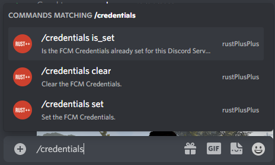

## **/customizetimers**

> **Operations to customize In-Game timers.** Calling the Slash commands without any options will return the currently configured time.

Subcommand | Options | Description | Required
---------- | ------- | ----------- | --------
`cargo_ship_egress_time` | &nbsp; | Get/Set time for cargo ship egress stage timer for connected server, default: 50min (3000s). | &nbsp;
&nbsp; | `seconds` | Seconds before cargo ship enters egress stage. | `False`
`bradley_apc_respawn_time` | &nbsp; | Get/Set time for Bradley APC respawn timer for connected server, default: 60min (3600s). | &nbsp;
&nbsp; | `seconds` | Seconds till Bradley APC respawns. | `False`
`crate_despawn_time` | &nbsp; | Get/Set time for Locked Crate despawn timer for connected server, default: 120min (7200s). | &nbsp;
&nbsp; | `seconds` | Seconds till Locked Crate despawns. | `False`
`crate_despawn_warning_time` | &nbsp; | Get/Set time for warning before Locked Crate despawns for connected server, default: 20min (1200s). | &nbsp;
&nbsp; | `seconds` | Seconds before Locked Crate despawn warning. | `False`
`oil_rig_crate_unlock_time` | &nbsp; | Get/Set time for Locked Crate on Oil Rig unlocks for connected server, default: 15min (900s). | &nbsp;
&nbsp; | `seconds` | Seconds till Locked Crate on Oil Rig unlocks. | `False`

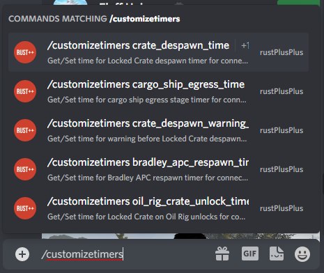

## **/help**

> Display help message.

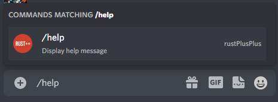

## **/leader**

> **Give or take the leadership from/to a team member.**

Subcommand | Options | Description | Required
---------- | ------- | ----------- | --------
&nbsp; | `member` | The name of the team member. | `True`

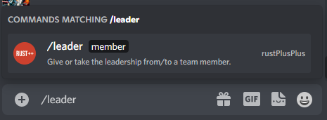

## **/map**

> **Get the currently connected server map image.**

Subcommand | Options | Description | Required
---------- | ------- | ----------- | --------
`all` | &nbsp; | Get the map including both monument names and markers. | &nbsp;
`clean` | &nbsp; | Get the clean map. | &nbsp;
`monuments`| &nbsp; | Get the map including monument names. | &nbsp;
`markers` | &nbsp; | Get the map including markers. | &nbsp;

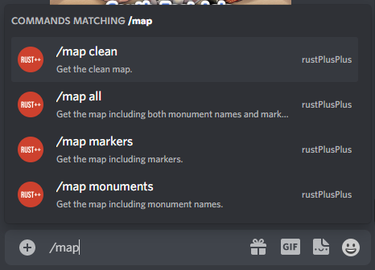

## **/market**

> **Operations for In-Game Vending Machines.**. Item subscription is currently not implemented.

Subcommand | Options | Description | Required
---------- | ------- | ----------- | --------
`search` | &nbsp; | Search for an item in Vending Machines. | &nbsp;
&nbsp; | `name` | The name of the item to search for. | `False`
&nbsp; | `id` | The ID of the item to search for. | `False`
`subscribe` | &nbsp; | Subscribe to an item in Vending Machines. | &nbsp;
&nbsp; | `name` | The name of the item to subscribe to. | `False`
&nbsp; | `id` | The ID of the item to subscribe to. | `False`
`unsubscribe` | &nbsp; | Unsubscribe to an item in Vending Machines. | &nbsp;
&nbsp; | `name` | The name of the item to unsubscribe to. | `False`
&nbsp; | `id` | The ID of the item to unsubscribe to. | `False`
`list` | &nbsp; | Display the subscription list. | &nbsp;

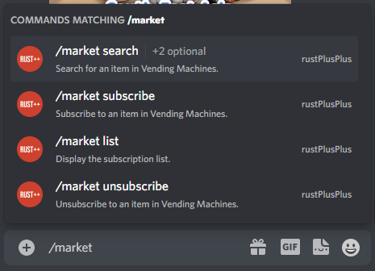

## **/players**

> **Get player/players information based on Battlemetrics.** Calling the Slash command without any options will return the entire list of players on the server.

Subcommand | Options | Description | Required
---------- | ------- | ----------- | --------
&nbsp; | `name` | The name or part of the name of the player. | `False`

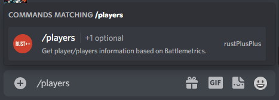

## **/reset**

> **Reset Discord channels.**

Subcommand | Options | Description | Required
---------- | ------- | ----------- | --------
`discord` | &nbsp; | Reset discord channels. | &nbsp;

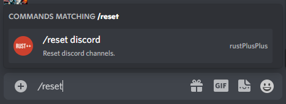

## **/role**

> **Set/Clear a specific role that will be able to see the rustPlusPlus category content.**

Subcommand | Options | Description | Required
---------- | ------- | ----------- | --------
`set` | &nbsp; | Set the role. | &nbsp;
&nbsp; | `role` | The role rustPlusPlus channels will be visible to. | `True`
`clear` | &nbsp; | Clear the role (to allow everyone to see the rustPlusPlus channels). | &nbsp;

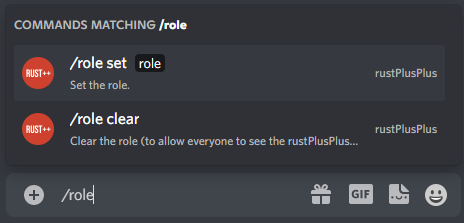

## **/storagemonitors**

> **Operations on Storage Monitors.**

Subcommand | Options | Description | Required
---------- | ------- | ----------- | --------
`edit` | &nbsp; | Edit the properties of a Storage Monitor. | &nbsp;
&nbsp; | `id` | The ID of the Storage Monitor. | `True`
&nbsp; | `name` | Rename the Storage Monitor. | `False`
&nbsp; | `image` | Set the image that best represent the Storage Monitor. | `False`
`recycle` | &nbsp; | Calculate the resources gained from recycling the content of a Storage Monitor. | &nbsp;
&nbsp; | `id` | The ID of the Storage Monitor. | `True`

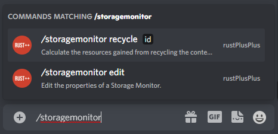

## **/switch**

> **Operations on Smart Switches.**

Subcommand | Options | Description | Required
---------- | ------- | ----------- | --------
`edit_switch` | &nbsp; | Edit the properties of a Smart Switch. | &nbsp;
&nbsp; | `id` | The ID of the Smart Switch. | `True`
&nbsp; | `image` | Set the image that best represent the Smart Switch. | `False`
`create_group` | &nbsp; | Create a Smart Switch Group. | &nbsp;
&nbsp; | `group_name` | The name of the Group to be created. | `True`
&nbsp; | `command` | Set the custom command for the Group. | `True`
`edit_group` | &nbsp; | Edit the properties of a Group. | &nbsp;
&nbsp; | `group_name` | The name of the Group. | `True`
&nbsp; | `command` | Set the custom command for the Group. | `False`
`add_switch` | &nbsp; | Add a Smart Switch to a Group. | &nbsp;
&nbsp; | `group_name` | The name of the Group. | `True`
&nbsp; | `switch_id` | The Smart Switch ID. | `True`
`remove_switch` | &nbsp; | Remove a Smart Switch to a Group. | &nbsp;
&nbsp; | `group_name` | The name of the Group. | `True`
&nbsp; | `switch_id` | The Smart Switch ID. | `True`

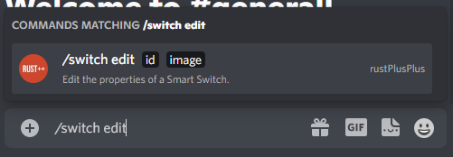

## **/tracker**

> **Operations for Battlemetrics Player Tracker**

Subcommand | Options | Description | Required
---------- | ------- | ----------- | --------
`edit` | &nbsp; | Edit a Battlemetrics Player Tracker. | &nbsp;
&nbsp; | `tracker_name` | The name of the Tracker. | `True`
&nbsp; | `new_tracker_name` | The new name for the tracker. | `True`
`add_player` | &nbsp; | Add a player to the Battlemetrics Player Tracker. | &nbsp;
&nbsp; | `tracker_name` | The name of the Tracker. | `True`
&nbsp; | `steam_id` | The steam ID for the player. | `True`
`remove_player` | &nbsp; | Remove a player from the Battlemetrics Player Tracker. | &nbsp;
&nbsp; | `tracker_name` | The name of the Tracker. | `True`
&nbsp; | `steam_id` | The steam ID for the player. | `True`

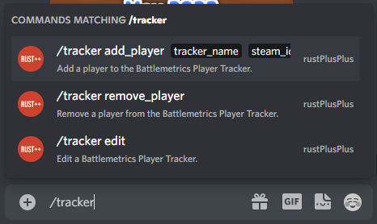

# In-Game Commands

In-Game Command | Description
--------------- | -----------
[**afk**](commands.md#afk) | Get the currently afk players in your team.
[**alive**](commands.md#alive) | Get the player with the longest time alive.
[**bradley**](commands.md#bradley) | Get information about Bradley APC (Time till respawn, time since last destroyed).
[**cargo**](commands.md#cargo) | Get information about CargoShip (Location, time till enters egress stage, current crates, time since last on map).
[**chinook**](commands.md#chinook) | Get information about Chinook 47 (Location, time since last on map).
[**crate**](commands.md#crate) | Get information about Locked Crate dropped by Chinook47 (Location, time till despawn, time since last dropped).
[**heli**](commands.md#heli) | Get information about Patrol Helicopter (Location, time since last downed, time since last on map).
[**large**](commands.md#large) | Get information about Large Oil Rig (Time till crate unlocks, time since last trigger).
[**leader**](commands.md#leader-1) | Give/Take the Team Leadership.
[**marker**](commands.md#marker) | Set custom markers anywhere on the map.
[**mute**](commands.md#mute) | Mute the bot from the In-Game Team Chat.
[**note/notes**](commands.md#notenotes) | Create notes about meaningful things.
[**offline**](commands.md#offline) | Get the currently offline players in your team.
[**online**](commands.md#online) | Get the currently online players in your team.
[**player/players**](commands.md#playerplayers) | Get the names and playtime of the currently online players on the server (Based on Battlemetrics).
[**pop**](commands.md#pop) | Get the current population of the server including queue size and max population.
[**prox**](commands.md#prox) | Get the distance to the three closest teammates.
[**small**](commands.md#small) | Get information about Small Oil Rig (Time till crate unlocks, time since last trigger).
[**time**](commands.md#time) | Get the current time In-Game and time till day/night.
[**timer**](commands.md#timer) | Set custom timers that will notify whenever the timer have expired.
[**tts**](commands.md#tts) | Send a Text-To-Speech message to the Discord teamchat channel.
[**unmute**](commands.md#unmute) | Unmute the bot from the In-Game Team Chat.
[**upkeep**](commands.md#upkeep) | Get the upkeep time of all connected tool cupboard monitors.
[**wipe**](commands.md#wipe) | Get the time since it was wiped.

## **afk**

> **Get the currently afk players in your team.** Definition of AFK for this command is inactivity (No change in XY-coordinate) for more than 5 minutes.
 Command: `!afk`

## **alive**

> **Get the player with the longest time alive.**
 Command: `!alive`

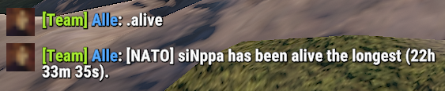

## **bradley**

> **Get information about Bradley APC (Time till respawn, time since last destroyed).**
 Command: `!bradley`

## **cargo**

> **Get information about CargoShip (Location, time till enters egress stage, current crates, time since last on map).**
 Command: `!cargo`

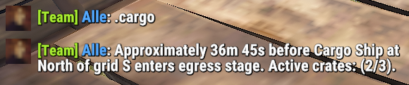

## **chinook**

> **Get information about Chinook 47 (Location, time since last on map).**
 Command: `!chinook`

## **crate**

> **Get information about Locked Crate dropped by Chinook47 (Location, time till despawn, time since last dropped).**
 Command: `!crate`

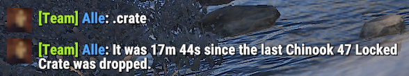

## **heli**

> **Get information about Patrol Helicopter (Location, time since last downed, time since last on map).**
 Command: `!heli`

## **large**

> **Get information about Large Oil Rig (Time till crate unlocks, time since last trigger).**
 Command: `!large`

## **leader**

> **Give/Take the Team Leadership.** Calling the leader command alone will give the caller leadership. You can also give the leadership to a team member by writing the name or part of the name after the command.
 `This command only works if the current leader is the person that setup the bot.`

Subcommand | Description | Required
---------- | ----------- | --------
`<team_member_name>` | The name or part of the name of a team member (`!leader <name>`). | `False`

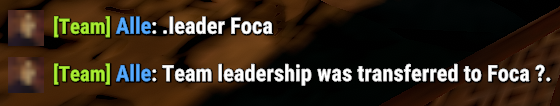

## **marker**

> **Set custom markers anywhere on the map.** This command can be very useful for small stash locations. Place down a small stash, create a marker on that spot and be able to navigate back to that exact place at a later stage.

Subcommand | Description | Required
---------- | ----------- | --------
`add` | Add a custom marker (`!marker add <name>`). | `False`
`remove` | Remove a custom marker (`!marker remove <id>`). | `False`
`list` | List all registered custom markers for this server with respective ID (`!marker list`). | `False`
`<marker_name>` | Calling with the name of the marker will let you navigate to that marker (`!marker <name>`). | `False`

## **mute**

> **Mute the bot from the In-Game Team Chat.** This will mute everything the bot would normally say in Team Chat such as command response, event notifications, timers, Smart Device notifications.
 Command: `!mute`

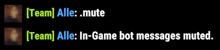

## **note/notes**

> **Create notes about meaningful things.** To add a note simply run `!note <text>`. To list all registered notes run `!notes`, all note ids will be presented as well.

Subcommand | Description | Required
---------- | ----------- | --------
`remove` | Remove a note (`!note remove <id>`). | `False`

## **offline**

> **Get the currently offline players in your team.**
 Command: `!offline`

## **online**

> **Get the currently online players in your team.**
 Command: `!online`

## **player/players**

> **Get the names and playtime of the currently online players on the server (Based on Battlemetrics).** To get all the currently online players on the server run `!players`. To get the information from a certain player run `!player <name or part of name>`.

## **pop**

> **Get the current population of the server including queue size and max population.**
 Command: `!pop`

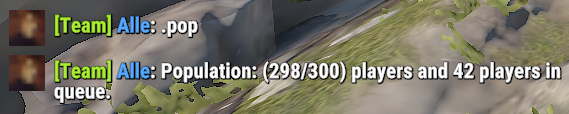

## **prox**

> **Get the distance to the three closest teammates.** To get the three closest teammates run `!prox`. To get the distance to a team member run `!prox <name or part of name>`.

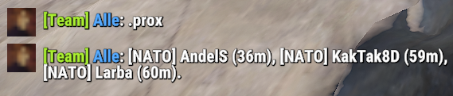

## **small**

> **Get information about Small Oil Rig (Time till crate unlocks, time since last trigger).**
 Command: `!small`

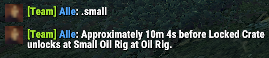

## **time**

> **Get the current time In-Game and time till day/night.**
 Command: `!time`

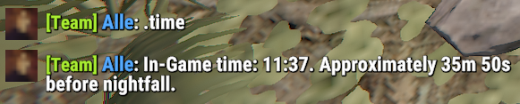

## **timer**

> **Set custom timers that will notify whenever the timer have expired.**
 `The argument <time> is used to set time in the format: 2h15m or 15m10s etc... (not space between d/h/m/s).`

Subcommand | Description | Required
---------- | ----------- | --------
`add` | Add a custom timer (`!timer add <time> <text>`). | `False`
`remove` | Remove a custom timer (`!timer remove <id>`). | `False`
`list` | List all registered custom timers (`!timer list`). | `False`

## **tr**

> **Translate a text from English to another language.**
 Command: `!tr <language-code> <Text>`

Subcommand | Description | Required
---------- | ----------- | --------
`language` | Get the language code (`!tr language <language>`). | `False`
`<language-code>` | Translate the text to this language (`!tr <language> <text>`). | `False`

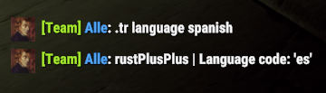
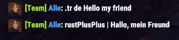

## **trf**

> **Translate a text from a language to another language.**
 Command: `!trf <language-code-from> <language-code-to> <Text>`

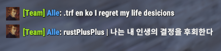

## **tts**

> **Send a Text-To-Speech message to the Discord teamchat channel.** To execute a Text-To-Speech command run `!tts <text>`.
 Command: `!tts <text>`

## **unmute**

> **Unmute the bot from the In-Game Team Chat.**
 Command: `!unmute`

## **upkeep**

> **Get the upkeep time of all connected tool cupboard monitors.**
 Command: `!upkeep`

## **wipe**

> **Get the time since it was wiped.**
 Command: `!wipe`

