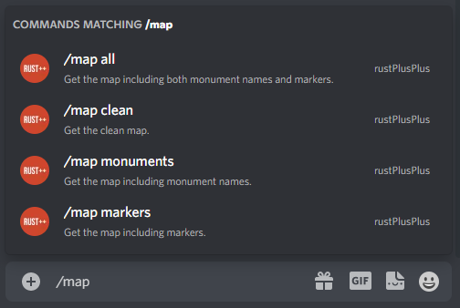
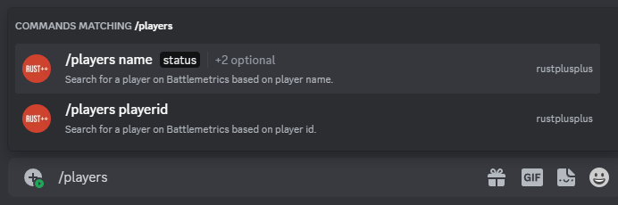
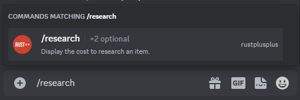
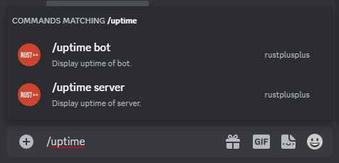
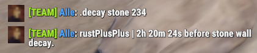

# Commands Documentation

> Commands can be executed via Discord or In-Game Team Chat. To be able to run Slash Commands in Discord, you need to be part of the designated Discord Role for the bot. If no role is set for the bot then everyone should be able to use the Slash Commands by default. To be able to run In-Game Commands, you need to be in the same In-Game Team as the hoster. In-Game Commands can only be run from Team Chat, not global chat. You can also run In-Game commands from the Discord Text-Channel `commands`.

- [Discord Slash Commands](commands.md#discord-slash-commands)
- [In-Game Commands](commands.md#in-game-commands)

# Discord Slash Commands

Slash Command | Description
------------- | -----------
[**/alarm**](commands.md#alarm) | Operations on Smart Alarms.
[**/alias**](commands.md#alias) | Create an alias for a command/sequence of characters.
[**/blacklist**](commands.md#blacklist) | Blacklist a user from using the bot.
[**/cctv**](commands.md#cctv) | Posts CCTV codes for a monument.
[**/craft**](commands.md#craft) | Display the cost to craft an item.
[**/credentials**](commands.md#credentials) | Set/Clear the Credentials for the user account.
[**/decay**](commands.md#decay) | Display the decay time of an item.
[**/help**](commands.md#help) | Display help message.
[**/item**](commands.md#item) | Get the details of an item.
[**/leader**](commands.md#leader) | Give or take the leadership from/to a team member.
[**/map**](commands.md#map) | Get the currently connected server map image.
[**/market**](commands.md#market) | Operations for In-Game Vending Machines.
[**/players**](commands.md#players) | Get player/players information based on battlemetrics.
[**/recycle**](commands.md#recycle) | Display the output of recycling an item.
[**/research**](commands.md#research) | Display the cost to research an item.
[**/reset**](commands.md#reset) | Reset Discord channels.
[**/role**](commands.md#role) | Set/Clear a specific role that will be able to see the rustplusplus category content.
[**/storagemonitor**](commands.md#storagemonitors) | Operations on Storage Monitors.
[**/switch**](commands.md#switch) | Operations on Smart Switches.
[**/upkeep**](commands.md#upkeep) | Get the upkeep cost of an item.
[**/uptime**](commands.md#uptime) | Display uptime of the bot and server.
[**/voice**](commands.md#voice) | Operations on Voice Feature.

## **/alarm**

> **Operations on Smart Alarms.**

Subcommand | Options | Description | Required
---------- | ------- | ----------- | --------
`edit` | &nbsp; | Edit the properties of a Smart Alarm. | &nbsp;
&nbsp; | `id` | The ID of the Smart Alarm. | `True`
&nbsp; | `image` | Set the image that best represent the Smart Alarm. | `True`

## **/alias**

> **Create an alias for a command/sequence of characters.**

Subcommand | Options | Description | Required
---------- | ------- | ----------- | --------
`add` | &nbsp; | Add an alias. | &nbsp;
&nbsp; | `alias` | The alias to use. | `True`
&nbsp; | `value` | The command/sequence of characters. | `True`
`remove` | &nbsp; | Remove an alias. | &nbsp;
&nbsp; | `index` | The index of the alias to remove. | `True`
`show` | &nbsp; | Show all registered aliases. | &nbsp;

## **/blacklist**

> **Blacklist a user from using the bot.**

Subcommand | Options | Description | Required
---------- | ------- | ----------- | --------
`add` | &nbsp; | Add user to the blacklist. | &nbsp;
&nbsp; | `discord_user` | The discord user. | `False`
&nbsp; | `steamid` | The steamid of the user. | `False`
`remove` | &nbsp; | Remove user from the blacklist. | &nbsp;
&nbsp; | `discord_user` | The discord user. | `False`
&nbsp; | `steamid` | The steamid of the user. | `False`
`show` | &nbsp; | Show blacklisted users. | &nbsp;

## **/cctv**

> **Posts CCTV codes for a monument.**

Subcommand | Options | Description | Required
---------- | ------- | ----------- | --------
&nbsp; | `monument` | Rust monument. | `True`

## **/craft**

> **Display the cost to craft an item.**

Subcommand | Options | Description | Required
---------- | ------- | ----------- | --------
&nbsp; | `name` | The name of the item to craft. | `False`
&nbsp; | `id` | The id of the item to craft. | `False`
&nbsp; | `quantity` | The quantity of items to craft. | `False`

## **/credentials**

> **Add/Remove the Credentials for the user account.**

Subcommand | Options | Description | Required
---------- | ------- | ----------- | --------
`add` | &nbsp; | Add Credentials. | &nbsp;
&nbsp; | `gcm_android_id` | GCM Android ID. | `True`
&nbsp; | `gcm_security_token` | GCM Security Token. | `True`
&nbsp; | `steam_id` | Steam ID. | `True`
&nbsp; | `issued_date` | Issued date of the credentials. | `True`
&nbsp; | `expire_date` | Expire date of the credentials. | `True`
&nbsp; | `hoster` | Should be hoster. | `False`
`remove` | &nbsp; | Remove Credentials. | &nbsp;
&nbsp; | `steam_id` | Steam ID. | `False`
`show` | &nbsp; | Show all registered Credentials. | &nbsp;
`set_hoster` | &nbsp; | Set the hoster. | &nbsp;
&nbsp; | `steam_id` | Steam ID. | `False`

## **/decay**

> **Display the decay time of an item.**

Subcommand | Options | Description | Required
---------- | ------- | ----------- | --------
&nbsp; | `name` | The name of the item. | `False`
&nbsp; | `id` | The id of the item. | `False`
&nbsp; | `hp` | THe current HP of the item. | `False`

## **/help**

> Display help message.

## **/item**

> **Get the details of an item.**

Subcommand | Options | Description | Required
---------- | ------- | ----------- | --------
&nbsp; | `name` | The name of the item. | `False`
&nbsp; | `id` | The id of the item. | `False`

## **/leader**

> **Give or take the leadership from/to a team member.**

Subcommand | Options | Description | Required
---------- | ------- | ----------- | --------
&nbsp; | `member` | The name of the team member. | `True`

## **/map**

> **Get the currently connected server map image.**

Subcommand | Options | Description | Required
---------- | ------- | ----------- | --------
`all` | &nbsp; | Get the map including both monument names and markers. | &nbsp;
`clean` | &nbsp; | Get the clean map. | &nbsp;
`monuments`| &nbsp; | Get the map including monument names. | &nbsp;
`markers` | &nbsp; | Get the map including markers. | &nbsp;

## **/market**

> **Operations for In-Game Vending Machines.**.

Subcommand | Options | Description | Required
---------- | ------- | ----------- | --------
`search` | &nbsp; | Search for an item in Vending Machines. | &nbsp;
&nbsp; | `order` | The order type to search for (all, buy, sell). | `True`
&nbsp; | `name` | The name of the item to search for. | `False`
&nbsp; | `id` | The ID of the item to search for. | `False`
`subscribe` | &nbsp; | Subscribe to an item in Vending Machines. | &nbsp;
&nbsp; | `order` | The order type (all, buy, sell). | `True`
&nbsp; | `name` | The name of the item to subscribe to. | `False`
&nbsp; | `id` | The ID of the item to subscribe to. | `False`
`unsubscribe` | &nbsp; | Unsubscribe to an item in Vending Machines. | &nbsp;
&nbsp; | `order` | The order type (all, buy, sell). | `True`
&nbsp; | `name` | The name of the item to unsubscribe to. | `False`
&nbsp; | `id` | The ID of the item to unsubscribe to. | `False`
`list` | &nbsp; | Display the subscription list. | &nbsp;

## **/players**

> **Get player/players information based on Battlemetrics.** Calling the subcommand name without the name option will display all players depending on status option. By calling the subcommand playerid, you will get more specific information about a single player.

Subcommand | Options | Description | Required
---------- | ------- | ----------- | --------
`name` | &nbsp; | Search for a player on Battlemetrics based on player name. | &nbsp;
&nbsp; | `status` | Search for players that are online/offline/any. | `True`
&nbsp; | `name` | The name of the player. | `False`
&nbsp; | `battlemetricsid` | The Battlemetrics ID of the server (default: The connected server). | `False`
`playerid` | &nbsp; | Search for a player on Battlemetrics based on player id. | &nbsp;
&nbsp; | `playerid` | The player id of the player. | `True`
&nbsp; | `battlemetricsid` | The Battlemetrics ID of the server (default: The connected server). | `False`

## **/recycle**

> **Display the output of recycling an item.**

Subcommand | Options | Description | Required
---------- | ------- | ----------- | --------
&nbsp; | `name` | The name of the item to recycle. | `False`
&nbsp; | `id` | The id of the item to recycle. | `False`
&nbsp; | `quantity` | The quantity of items to recycle. | `False`

## **/research**

> **Display the cost to research an item.**

Subcommand | Options | Description | Required
---------- | ------- | ----------- | --------
&nbsp; | `name` | The name of the item to research. | `False`
&nbsp; | `id` | The id of the item to research. | `False`

## **/reset**

> **Reset Discord channels.**

Subcommand | Options | Description | Required
---------- | ------- | ----------- | --------
`discord` | &nbsp; | Reset discord channels. | &nbsp;
`information` | &nbsp; | Reset information channel. | &nbsp;
`servers` | &nbsp; | Reset servers channel. | &nbsp;
`settings` | &nbsp; | Reset settings channel. | &nbsp;
`switches` | &nbsp; | Reset switches channels. | &nbsp;
`alarms` | &nbsp; | Reset alarms channel. | &nbsp;
`storagemonitors` | &nbsp; | Reset storagemonitors channel. | &nbsp;
`trackers` | &nbsp; | Reset trackers channel. | &nbsp;

## **/role**

> **Set/Clear a specific role that will be able to see the rustplusplus category content.**

Subcommand | Options | Description | Required
---------- | ------- | ----------- | --------
`set` | &nbsp; | Set the role. | &nbsp;
&nbsp; | `role` | The role rustplusplus channels will be visible to. | `True`
`clear` | &nbsp; | Clear the role (to allow everyone to see the rustplusplus channels). | &nbsp;

## **/storagemonitors**

> **Operations on Storage Monitors.**

Subcommand | Options | Description | Required
---------- | ------- | ----------- | --------
`edit` | &nbsp; | Edit the properties of a Storage Monitor. | &nbsp;
&nbsp; | `id` | The ID of the Storage Monitor. | `True`
&nbsp; | `image` | Set the image that best represent the Storage Monitor. | `True`

## **/switch**

> **Operations on Smart Switches.**

Subcommand | Options | Description | Required
---------- | ------- | ----------- | --------
`edit` | &nbsp; | Edit the properties of a Smart Switch. | &nbsp;
&nbsp; | `id` | The ID of the Smart Switch. | `True`
&nbsp; | `image` | Set the image that best represent the Smart Switch. | `True`

## **/upkeep**

> **Get the upkeep cost of an item.**

Subcommand | Options | Description | Required
---------- | ------- | ----------- | --------
&nbsp; | `name` | The name of the item. | `False`
&nbsp; | `id` | The id of the item. | `False`

## **/uptime**

> **Display uptime of the bot and server.**

Subcommand | Options | Description | Required
---------- | ------- | ----------- | --------
`bot` | &nbsp; | Display uptime of bot. | &nbsp;
`server` | &nbsp; | Display uptime of server. | &nbsp;

## **/voice**

> **Operations on Voice Feature.**

Subcommand | Options | Description | Required
---------- | ------- | ----------- | --------
`join` | &nbsp; | Bot Joins a Voicechannel. | &nbsp;
`leave` | &nbsp; | Bot Leaves a Voicechannel. | &nbsp;

# In-Game Commands

In-Game Command | Description
--------------- | -----------
[**afk**](commands.md#afk) | Get the currently afk players in your team.
[**alive**](commands.md#alive) | Get the player with the longest time alive.
[**cargo**](commands.md#cargo) | Get information about CargoShip (Location, time till enters egress stage, time since last on map).
[**chinook**](commands.md#chinook) | Get information about Chinook 47 (Location, time since last on map).
[**connection/connections**](commands.md#connectionconnections) | Get recent connection events.
[**craft**](commands.md#craft-ingame) | Display the cost to craft an item.
[**death/deaths**](commands.md#deathdeaths) | Get recent death events.
[**decay**](commands.md#decay-ingame) | Display the decay time of an item.
[**events**](commands.md#events) | Get recent events.
[**heli**](commands.md#heli) | Get information about Patrol Helicopter (Location, time since last downed, time since last on map).
[**large**](commands.md#large) | Get information about Large Oil Rig (Time till crate unlocks, time since last trigger).
[**leader**](commands.md#leader-1) | Give/Take the Team Leadership.
[**marker**](commands.md#marker) | Set custom markers anywhere on the map.
[**market**](commands.md#market-ingame) | Search for items in vending machines or subscribe/unsubscribe to items.
[**mute**](commands.md#mute) | Mute the bot from the In-Game Team Chat.
[**note/notes**](commands.md#notenotes) | Create notes about meaningful things.
[**offline**](commands.md#offline) | Get the currently offline players in your team.
[**online**](commands.md#online) | Get the currently online players in your team.
[**player/players**](commands.md#playerplayers) | Get the names and playtime of the currently online players on the server (Based on Battlemetrics).
[**pop**](commands.md#pop) | Get the current population of the server including queue size and max population.
[**prox**](commands.md#prox) | Get the distance to the three closest teammates.
[**recycle**](commands.md#recycle-ingame) | Display the output of recycling an item.
[**research**](commands.md#research-ingame) | Display the cost to research an item.
[**send**](commands.md#send) | Send a message to a discord user.
[**small**](commands.md#small) | Get information about Small Oil Rig (Time till crate unlocks, time since last trigger).
[**steamid**](commands.md#steamid) | Get the steamid of a teammate.
[**team**](commands.md#team) | Get the names of all members in the team.
[**time**](commands.md#time) | Get the current time In-Game and time till day/night.
[**timer**](commands.md#timer) | Set custom timers that will notify whenever the timer have expired.
[**tr**](commands.md#tr) | Translate a text to another language.
[**trf**](commands.md#trf) | Translate a text from one language to another.
[**tts**](commands.md#tts) | Send a Text-To-Speech message to the Discord teamchat channel.
[**unmute**](commands.md#unmute) | Unmute the bot from the In-Game Team Chat.
[**upkeep**](commands.md#upkeep) | Get the upkeep time of all connected tool cupboard monitors.
[**uptime**](commands.md#uptime-ingame) | Display uptime of the bot and server.
[**wipe**](commands.md#wipe) | Get the time since it was wiped.

## **afk**

> **Get the currently afk players in your team.** Definition of AFK for this command is inactivity (No change in XY-coordinate) for more than 5 minutes.
 Command: `!afk`

## **alive**

> **Get the player with the longest time alive or the alive time of a teammate.**
 Command: `!alive`
 Command: `!alive Alle`

## **cargo**

> **Get information about CargoShip (Location, time till enters egress stage, time since last on map).**
 Command: `!cargo`

## **chinook**

> **Get information about Chinook 47 (Location, time since last on map).**
 Command: `!chinook`

## **connection/connections**

> **Get recent connection events of the team or from a specific teammate.**
 Command: `!connections`
 Command: `!connection Alle`

## **craft ingame**

> **Display the cost to craft an item (Quantity is optional).**
 Command: `!craft <item-name> <quantity>`
 Command: `!craft Assault Rifle 10`
 Command: `!craft rocket 100`

## **death/deaths**

> **Get recent death events of the team or from a specific teammate.**
 Command: `!deaths`
 Command: `!death Alle`

## **decay ingame**

> **Display the decay time of an item.**
 Command: `!decay`
 Command: `!decay Sheet Metal Door`
 Command: `!decay Tug Boat 100`
 Command: `!decay armored wall 450`

## **events**

> **Get recent In-Game events.** Available events are cargo, heli, small, large, chinook
 Command: `!events` - Get last 5 events
 Command: `!events 3` - Get last 3 events
 Command: `!events cargo` - Get last 5 events from cargo
 Command: `!events cargo 2` - Get last 2 events from cargo

## **heli**

> **Get information about Patrol Helicopter (Location, time since last downed, time since last on map).**
 Command: `!heli`

## **large**

> **Get information about Large Oil Rig (Time till crate unlocks, time since last trigger).**
 Command: `!large`

## **leader**

> **Give/Take the Team Leadership.** Calling the leader command alone will give the caller leadership. You can also give the leadership to a team member by writing the name or part of the name after the command.
 `This command only works if the current leader is the person that setup the bot.`

Subcommand | Description | Required
---------- | ----------- | --------
`<team_member_name>` | The name or part of the name of a team member (`!leader <name>`). | `False`

## **marker**

> **Set custom markers anywhere on the map.** This command can be very useful for small stash locations. Place down a small stash, create a marker on that spot and be able to navigate back to that exact place at a later stage. To list all registered markers, run `!markers`.

Subcommand | Description | Required
---------- | ----------- | --------
`add` | Add a custom marker (`!marker add <name>`). | `False`
`remove` | Remove a custom marker (`!marker remove <id>`). | `False`
`<marker_name>` | Calling with the name of the marker will let you navigate to that marker (`!marker <name>`). | `False`

## **market ingame**

> **Search for items in vending machines or subscribe/unsubscribe to items.**
 Command: `!market search sell Thompson`
 Command: `!market sub sell m249`
 Command: `!market sub all Scrap`
 Command: `!market unsub sell m249`
 Command: `!market list`

Subcommand | Description | Required
---------- | ----------- | --------
`search` | Search for an item in Vending Machines (`!market search sell thompson`). | `False`
`sub` | Subscribe to an item in Vending Machines (`!market sub all thompson`). | `False`
`unsub` | Unsubscribe to an item in Vending Machines (`!market unsub sell thompson`). | `False`
`list` | Display the subscription list (`!market list`). | `False`

## **mute**

> **Mute the bot from the In-Game Team Chat.** This will mute everything the bot would normally say in Team Chat such as command response, event notifications, timers, Smart Device notifications.
 Command: `!mute`

## **note/notes**

> **Create notes about meaningful things.** To list all registered notes run `!notes`, all note ids will be presented as well.

Subcommand | Description | Required
---------- | ----------- | --------
`add` | Add a note (`!note add <text>`). | `False`
`remove` | Remove a note (`!note remove <id>`). | `False`

## **offline**

> **Get the currently offline players in your team.**
 Command: `!offline`

## **online**

> **Get the currently online players in your team.**
 Command: `!online`

## **player/players**

> **Get the names and playtime of the currently online players on the server (Based on Battlemetrics).** To get all the currently online players on the server run `!players`. To get the information from a certain player run `!player <name or part of name>`.

## **pop**

> **Get the current population of the server including queue size and max population.**
 Command: `!pop`

## **prox**

> **Get the distance to the three closest teammates.** To get the three closest teammates run `!prox`. To get the distance to a team member run `!prox <name or part of name>`.

## **recycle ingame**

> **Display the output of recycling an item (Quantity is optional).**
 Command: `!recycle <item-name> <quantity>`
 Command: `!recycle Assault Rifle 10`
 Command: `!recycle rocket 100`

## **research ingame**

> **Display the cost to research an item.**
 Command: `!research <item-name>`
 Command: `!research Assault Rifle`
 Command: `!research rocket`

## **send**

> **Send a message to a discord user.**
 Command: `!send Alle Hello my friend!`

## **small**

> **Get information about Small Oil Rig (Time till crate unlocks, time since last trigger).**
 Command: `!small`

## **steamid**

> **Get the steamid of a teammate.**

Subcommand | Description | Required
---------- | ----------- | --------
`<team_member_name>` | The name or part of the name of a team member (`!steamid <name>`). | `False`

## **team**

> **Get the names of all members in the team.**
 Command: `!team`

## **time**

> **Get the current time In-Game and time till day/night.**
 Command: `!time`

## **timer**

> **Set custom timers that will notify whenever the timer have expired.** To list all registered timers run `!timers`.
 `The argument <time> is used to set time in the format: 2h15m or 15m10s etc... (not space between d/h/m/s).`

Subcommand | Description | Required
---------- | ----------- | --------
`add` | Add a custom timer (`!timer add <time> <text>`). | `False`
`remove` | Remove a custom timer (`!timer remove <id>`). | `False`

## **tr**

> **Translate a text from English to another language.**
 Command: `!tr <language-code> <Text>`

Subcommand | Description | Required
---------- | ----------- | --------
`language` | Get the language code (`!tr language <language>`). | `False`
`<language-code>` | Translate the text to this language (`!tr <language> <text>`). | `False`

## **trf**

> **Translate a text from a language to another language.**
 Command: `!trf <language-code-from> <language-code-to> <Text>`

## **tts**

> **Send a Text-To-Speech message to the Discord teamchat channel.** To execute a Text-To-Speech command run `!tts <text>`.
 Command: `!tts <text>`

## **unmute**

> **Unmute the bot from the In-Game Team Chat.**
 Command: `!unmute`

## **upkeep**

> **Get the upkeep time of all connected tool cupboard monitors.**
 Command: `!upkeep`

## **uptime ingame**

> **Display the uptime of the bot and server.**
 Command: `!uptime`

## **wipe**

> **Get the time since it was wiped.**
 Command: `!wipe`

