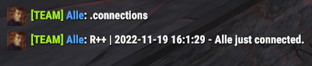
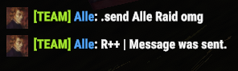

# 명령어 설명서

> 명령은 디스코드 또는 게임 내 팀 채팅을 통해 실행할 수 있습니다. 디스코드에서 슬래시 명령을 실행할 수 있으려면 봇에 대해 지정된 디스코드 역할의 일부여야 합니다. 봇에 대한 역할이 설정되지 않은 경우 모든 사람이 기본적으로 슬래시 명령을 사용할 수 있어야 합니다. 게임 내 명령을 실행할 수 있으려면 FCM 자격 증명을 설정한 사람과 동일한 게임 내 팀에 있어야 합니다. 게임 내 명령은 글로벌 채팅이 아닌 팀 채팅에서만 실행할 수 있습니다.

- [Discord 슬래시 명령어](commands.md#discord-slash-commands)
- [게임 내 명령어](commands.md#in-game-commands)

# Discord 슬래시 명령어

슬래시 명령어 | 설명
------------- | -----------
[**/alarm**](commands.md#alarm) | 스마트 알람에 대한 작업.
[**/credentials**](commands.md#credentials) | 사용자 계정에 대한 FCM 자격 증명 설정/지우기.
[**/help**](commands.md#help) | 도움말 메시지를 표시합니다.
[**/leader**](commands.md#leader) | 팀 구성원에게 리더십을 제공하거나 가져옵니다.
[**/map**](commands.md#map) | 현재 연결된 서버 맵 이미지를 가져옵니다.
[**/market**](commands.md#market) | 게임 내 자판기 운영관련 명령어.
[**/players**](commands.md#players) | battlemetrics를 기반으로 플레이어/플레이어 정보를 가져옵니다.
[**/reset**](commands.md#reset) | Discord 채널을 재설정합니다.
[**/role**](commands.md#role) | rustPlusPlus 카테고리 콘텐츠를 볼 수 있는 특정 역할을 설정/해제합니다.
[**/storagemonitor**](commands.md#storagemonitors) | 보관 측정장치에 대한 작업.
[**/switch**](commands.md#switch) | 스마트 스위치에 대한 작업.

## **/alarm**

> **스마트 알람에 대한 작업.**

서브명령어 | 옵션 | 설명 | 필수체크
---------- | ------- | ----------- | --------
`edit` | &nbsp; | 스마트 알람의 속성을 편집합니다. | &nbsp;
&nbsp; | `id` | 스마트 알람의 ID. | `True`
&nbsp; | `image` | 스마트 알람을 나타내는 이미지를 설정하세요. | `True`

## **/credentials**

> **사용자 계정에 대한 FCM 자격 증명을 추가/제거합니다.**

서브명령어 | 옵션 | 설명 | 필수체크
---------- | ------- | ----------- | --------
`add` | &nbsp; | FCM 자격 증명을 추가합니다. | &nbsp;
&nbsp; | `keys_private_key` | Keys Private Key. | `True`
&nbsp; | `keys_public_key` | Keys Public Key. | `True`
&nbsp; | `keys_auth_secret` | Keys Auth Secret. | `True`
&nbsp; | `fcm_token` | FCM Token. | `True`
&nbsp; | `fcm_push_set` | FCM Push Set. | `True`
&nbsp; | `gcm_token` | GCM Token. | `True`
&nbsp; | `gcm_android_id` | FCM Android ID. | `True`
&nbsp; | `gcm_security_token` | GCM Security Token. | `True`
&nbsp; | `gcm_app_id` | GCM App ID. | `True`
&nbsp; | `steam_id` | Steam ID. | `True`
&nbsp; | `hoster` | Should be hoster. | `False`
`remove` | &nbsp; | Remove FCM Credentials. | &nbsp;
&nbsp; | `steam_id` | Steam ID. | `False`
`show` | &nbsp; | Show all registered FCM Credentials. | &nbsp;
`set_hoster` | &nbsp; | Set the hoster. | &nbsp;
&nbsp; | `steam_id` | Steam ID. | `False`

## **/help**

> 도움말 메시지를 표시합니다.

## **/leader**

> **팀 구성원에게 리더를 제공하거나 가져옵니다.**

서브커맨드 | 옵션 | 설명 | 필수체크
---------- | ------- | ----------- | --------
&nbsp; | `member` | 팀원의 이름입니다. | `True`

## **/map**

> **현재 연결된 서버 맵 이미지를 가져옵니다.**

서브커맨드 | 옵션 | 설명 | 필수체크
---------- | ------- | ----------- | --------
`all` | &nbsp; | 특정 지역 이름과 마커가 모두 포함된 지도를 가져옵니다. | &nbsp;
`clean` | &nbsp; | 깨끗한지도를 가져옵니다. | &nbsp;
`monuments`| &nbsp; | 특정 지역 이름이 포함된 지도를 가져옵니다. | &nbsp;
`markers` | &nbsp; | 마커가 포함된 지도를 가져옵니다. | &nbsp;

## **/market**

> **게임 내 자판기 운영.**. Item subscription is currently not implemented.

서브커맨드 | 옵션 | 설명 | 필수체크
---------- | ------- | ----------- | --------
`search` | &nbsp; | 자판기에서 아이템을 검색합니다. | &nbsp;
&nbsp; | `name` | 검색할 항목의 이름입니다. | `False`
&nbsp; | `id` | 검색할 항목의 ID입니다. | `False`
`subscribe` | &nbsp; | 자동 판매기에서 항목을 구독합니다. | &nbsp;
&nbsp; | `name` | 구독할 항목의 이름입니다. | `False`
&nbsp; | `id` | 구독할 항목의 ID입니다. | `False`
`unsubscribe` | &nbsp; | 자동 판매기에서 항목 구독을 취소합니다. | &nbsp;
&nbsp; | `name` | 구독을 취소할 항목의 이름입니다. | `False`
&nbsp; | `id` | 구독을 취소할 항목의 ID입니다. | `False`
`list` | &nbsp; | 구독 목록을 표시합니다. | &nbsp;

## **/players**

> **Battlemetrics를 기반으로 플레이어/플레이어 정보 얻기.** Calling the Slash command without any options will return the entire list of players on the server.

Subcommand | Options | Description | Required
---------- | ------- | ----------- | --------
&nbsp; | `name` | The name or part of the name of the player. | `False`

## **/reset**

> **Reset Discord channels.**

Subcommand | Options | Description | Required
---------- | ------- | ----------- | --------
`discord` | &nbsp; | Reset discord channels. | &nbsp;
`information` | &nbsp; | Reset information channel. | &nbsp;
`servers` | &nbsp; | Reset servers channel. | &nbsp;
`settings` | &nbsp; | Reset settings channel. | &nbsp;
`switches` | &nbsp; | Reset switches channels. | &nbsp;
`alarms` | &nbsp; | Reset alarms channel. | &nbsp;
`storagemonitors` | &nbsp; | Reset storagemonitors channel. | &nbsp;
`trackers` | &nbsp; | Reset trackers channel. | &nbsp;

## **/role**

> **Set/Clear a specific role that will be able to see the rustPlusPlus category content.**

Subcommand | Options | Description | Required
---------- | ------- | ----------- | --------
`set` | &nbsp; | Set the role. | &nbsp;
&nbsp; | `role` | The role rustPlusPlus channels will be visible to. | `True`
`clear` | &nbsp; | Clear the role (to allow everyone to see the rustPlusPlus channels). | &nbsp;

## **/storagemonitors**

> **Operations on Storage Monitors.**

Subcommand | Options | Description | Required
---------- | ------- | ----------- | --------
`edit` | &nbsp; | Edit the properties of a Storage Monitor. | &nbsp;
&nbsp; | `id` | The ID of the Storage Monitor. | `True`
&nbsp; | `image` | Set the image that best represent the Storage Monitor. | `True`

## **/switch**

> **Operations on Smart Switches.**

Subcommand | Options | Description | Required
---------- | ------- | ----------- | --------
`edit` | &nbsp; | Edit the properties of a Smart Switch. | &nbsp;
&nbsp; | `id` | The ID of the Smart Switch. | `True`
&nbsp; | `image` | Set the image that best represent the Smart Switch. | `True`

# In-Game Commands

In-Game Command | Description
--------------- | -----------
[**afk**](commands.md#afk) | Get the currently afk players in your team.
[**alive**](commands.md#alive) | Get the player with the longest time alive.
[**bradley**](commands.md#bradley) | Get information about Bradley APC (Time till respawn, time since last destroyed).
[**cargo**](commands.md#cargo) | Get information about CargoShip (Location, time till enters egress stage, current crates, time since last on map).
[**chinook**](commands.md#chinook) | Get information about Chinook 47 (Location, time since last on map).
[**connection/connections**](commands.md#connectionconnections) | Get recent connection events.
[**crate**](commands.md#crate) | Get information about Locked Crate dropped by Chinook47 (Location, time till despawn, time since last dropped).
[**death/deaths**](commands.md#deathdeaths) | Get recent death events.
[**heli**](commands.md#heli) | Get information about Patrol Helicopter (Location, time since last downed, time since last on map).
[**large**](commands.md#large) | Get information about Large Oil Rig (Time till crate unlocks, time since last trigger).
[**leader**](commands.md#leader-1) | Give/Take the Team Leadership.
[**marker**](commands.md#marker) | Set custom markers anywhere on the map.
[**market**](commands.md#market-ingame) | Search for items in vending machines or subscribe/unsubscribe to items.
[**mute**](commands.md#mute) | Mute the bot from the In-Game Team Chat.
[**note/notes**](commands.md#notenotes) | Create notes about meaningful things.
[**offline**](commands.md#offline) | Get the currently offline players in your team.
[**online**](commands.md#online) | Get the currently online players in your team.
[**player/players**](commands.md#playerplayers) | Get the names and playtime of the currently online players on the server (Based on Battlemetrics).
[**pop**](commands.md#pop) | Get the current population of the server including queue size and max population.
[**prox**](commands.md#prox) | Get the distance to the three closest teammates.
[**send**](commands.md#send) | Send a message to a discord user.
[**small**](commands.md#small) | Get information about Small Oil Rig (Time till crate unlocks, time since last trigger).
[**time**](commands.md#time) | Get the current time In-Game and time till day/night.
[**timer**](commands.md#timer) | Set custom timers that will notify whenever the timer have expired.
[**tr**](commands.md#tr) | Translate a text to another language.
[**trf**](commands.md#trf) | Translate a text from one language to another.
[**tts**](commands.md#tts) | Send a Text-To-Speech message to the Discord teamchat channel.
[**unmute**](commands.md#unmute) | Unmute the bot from the In-Game Team Chat.
[**upkeep**](commands.md#upkeep) | Get the upkeep time of all connected tool cupboard monitors.
[**wipe**](commands.md#wipe) | Get the time since it was wiped.

## **afk**

> **Get the currently afk players in your team.** Definition of AFK for this command is inactivity (No change in XY-coordinate) for more than 5 minutes.
 Command: `!afk`

## **alive**

> **Get the player with the longest time alive or the alive time of a teammate.**
 Command: `!alive`
 Command: `!alive Alle`

## **bradley**

> **Get information about Bradley APC (Time till respawn, time since last destroyed).**
 Command: `!bradley`

## **cargo**

> **Get information about CargoShip (Location, time till enters egress stage, current crates, time since last on map).**
 Command: `!cargo`

## **chinook**

> **Get information about Chinook 47 (Location, time since last on map).**
 Command: `!chinook`

## **connection/connections**

> **Get recent connection events of the team or from a specific teammate.**
 Command: `!connections`
 Command: `!connection Alle`

## **crate**

> **Get information about Locked Crate dropped by Chinook47 (Location, time till despawn, time since last dropped).**
 Command: `!crate`

## **death/deaths**

> **Get recent death events of the team or from a specific teammate.**
 Command: `!deaths`
 Command: `!death Alle`

## **heli**

> **Get information about Patrol Helicopter (Location, time since last downed, time since last on map).**
 Command: `!heli`

## **large**

> **Get information about Large Oil Rig (Time till crate unlocks, time since last trigger).**
 Command: `!large`

## **leader**

> **Give/Take the Team Leadership.** Calling the leader command alone will give the caller leadership. You can also give the leadership to a team member by writing the name or part of the name after the command.
 `This command only works if the current leader is the person that setup the bot.`

Subcommand | Description | Required
---------- | ----------- | --------
`<team_member_name>` | The name or part of the name of a team member (`!leader <name>`). | `False`

## **marker**

> **Set custom markers anywhere on the map.** This command can be very useful for small stash locations. Place down a small stash, create a marker on that spot and be able to navigate back to that exact place at a later stage.

Subcommand | Description | Required
---------- | ----------- | --------
`add` | Add a custom marker (`!marker add <name>`). | `False`
`remove` | Remove a custom marker (`!marker remove <id>`). | `False`
`list` | List all registered custom markers for this server with respective ID (`!marker list`). | `False`
`<marker_name>` | Calling with the name of the marker will let you navigate to that marker (`!marker <name>`). | `False`

## **market ingame**

> **Search for items in vending machines or subscribe/unsubscribe to items.**

Subcommand | Description | Required
---------- | ----------- | --------
`search` | Search for an item in Vending Machines (`!market search thompson`). | `False`
`subscribe` | Subscribe to an item in Vending Machines (`!market sub thompson`). | `False`
`unsubscribe` | Unsubscribe to an item in Vending Machines (`!market unsub thompson`). | `False`
`list` | Display the subscription list (`!market list`). | `False`

## **mute**

> **Mute the bot from the In-Game Team Chat.** This will mute everything the bot would normally say in Team Chat such as command response, event notifications, timers, Smart Device notifications.
 Command: `!mute`

## **note/notes**

> **Create notes about meaningful things.** To list all registered notes run `!notes`, all note ids will be presented as well.

Subcommand | Description | Required
---------- | ----------- | --------
`add` | Add a note (`!note add <text>`). | `False`
`remove` | Remove a note (`!note remove <id>`). | `False`

## **offline**

> **Get the currently offline players in your team.**
 Command: `!offline`

## **online**

> **Get the currently online players in your team.**
 Command: `!online`

## **player/players**

> **Get the names and playtime of the currently online players on the server (Based on Battlemetrics).** To get all the currently online players on the server run `!players`. To get the information from a certain player run `!player <name or part of name>`.

## **pop**

> **Get the current population of the server including queue size and max population.**
 Command: `!pop`

## **prox**

> **Get the distance to the three closest teammates.** To get the three closest teammates run `!prox`. To get the distance to a team member run `!prox <name or part of name>`.

## **send**

> **Send a message to a discord user.**
 Command: `!send Alle Hello my friend!`

## **small**

> **Get information about Small Oil Rig (Time till crate unlocks, time since last trigger).**
 Command: `!small`

## **time**

> **Get the current time In-Game and time till day/night.**
 Command: `!time`

## **timer**

> **Set custom timers that will notify whenever the timer have expired.**
 `The argument <time> is used to set time in the format: 2h15m or 15m10s etc... (not space between d/h/m/s).`

Subcommand | Description | Required
---------- | ----------- | --------
`add` | Add a custom timer (`!timer add <time> <text>`). | `False`
`remove` | Remove a custom timer (`!timer remove <id>`). | `False`
`list` | List all registered custom timers (`!timer list`). | `False`

## **tr**

> **Translate a text from English to another language.**
 Command: `!tr <language-code> <Text>`

Subcommand | Description | Required
---------- | ----------- | --------
`language` | Get the language code (`!tr language <language>`). | `False`
`<language-code>` | Translate the text to this language (`!tr <language> <text>`). | `False`

## **trf**

> **Translate a text from a language to another language.**
 Command: `!trf <language-code-from> <language-code-to> <Text>`

## **tts**

> **Send a Text-To-Speech message to the Discord teamchat channel.** To execute a Text-To-Speech command run `!tts <text>`.
 Command: `!tts <text>`

## **unmute**

> **Unmute the bot from the In-Game Team Chat.**
 Command: `!unmute`

## **upkeep**

> **Get the upkeep time of all connected tool cupboard monitors.**
 Command: `!upkeep`

## **wipe**

> **Get the time since it was wiped.**
 Command: `!wipe`

