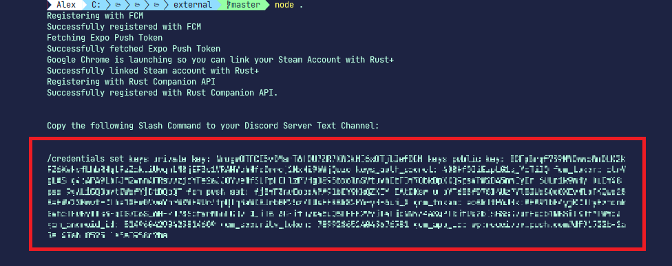

# FCM Credentials Documentation

> To be able to use an instance of the bot properly, you want to setup your FCM Credentials. Adding these credentials makes it possible for you to pair with servers as well as connecting to them.

## Retrieving FCM Credentials

Open a terminal (`Git Bash` / `CMD` / `Terminal` / `PowerShell` or similar) and run the following commands:

    $ cd src/external
    $ npm install
    $ node .

This will open up an instance of Google Chrome where you need to login with your Steam Account to get access to FCM Credentials. Once the login is successful, you will be given a `Discord Slash Command` string (/credential set) that you shall copy and then run in your Discord Server Text Channel. Which Text Channel you run the Slash Command is not important, as long as the bot has access to it.

## Why is FCM Credentials necessary?

FCM Credentials are necessary in order to get the following:

* Server Pairing Notifications
* Smart Devices Pairing Notifications
* Smart Alarm Notifications
* Player Offline Death Notifications
* Teammate Login Notifications
* Facepunch News

Without these, the bot would not operate properly.