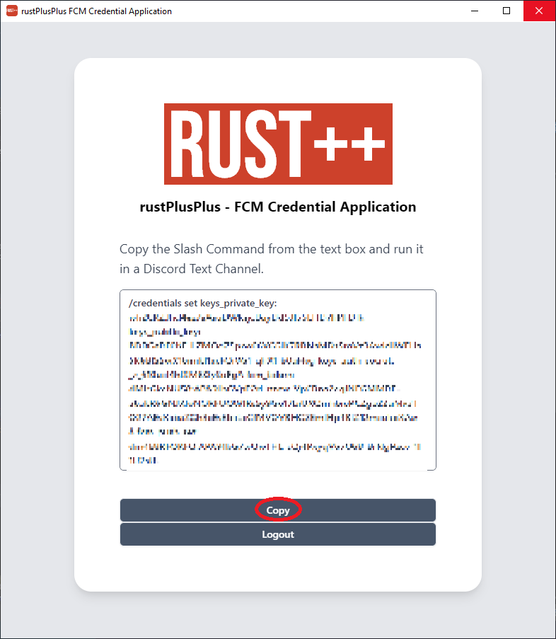

# FCM Credentials Documentation

> To be able to use an instance of the bot properly, you want to setup your FCM Credentials. Adding these credentials makes it possible for you to pair with servers as well as connecting to them.

## Retrieving FCM Credentials

* Download and install the [rustPlusPlus FCM Credential Application](https://github.com/alexemanuelol/rustPlusPlus-Credential-Application/releases/download/v1.0.2/rustPlusPlus-1.0.2-win-x64.exe)
* Once downloaded and installed, open it and press the button `Connect with Rust+`.

* Another window will pop up where you need to login with your Steam Account.

* When you have logged in, you should be greeted with a window that display the Slash Command /credentials set .....
* Click `Copy` to copy the Slash Command.

* Paste the Slash command in your Discord Server Text Channel. Which Text Channel you run the Slash Command is not important, as long as the bot has access to it.

## Why is FCM Credentials necessary?

FCM Credentials are necessary in order to get the following:

* Server Pairing Notifications
* Smart Devices Pairing Notifications
* Smart Alarm Notifications
* Player Offline Death Notifications
* Teammate Login Notifications
* Facepunch News

Without these, the bot would not operate properly.