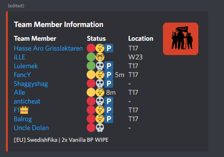

# Credentials Documentation

> To be able to use an instance of the bot properly, you want to setup your Credentials. Adding these credentials makes it possible for you to pair with servers as well as connecting to them.

## Retrieving Credentials

* Download and install the [rustplusplus credential application](https://github.com/alexemanuelol/rustplusplus-credential-application/releases/download/v1.4.0/rustplusplus-1.4.0-win-x64.exe)
* Once downloaded and installed, open it and press the button `Connect with Rust+`.

* Another window will pop up where you need to login with your Steam Account.

* When you have logged in, you should be greeted with a window that display the Slash Command /credentials add .....
* Click `Copy` to copy the Slash Command.

* Paste the Slash command in your Discord Server Text Channel. Which Text Channel you run the Slash Command is not important, as long as the bot has access to it.

* This process is the same for the owner of the bot as well as any teammate that want to register their credentials (mainly for the purpose to extend the usage of the leader command). Once a teammate have registered their credentials, they just need to go inside the game and pair with the server. Which teammates that have paired with the server can be seen in the information channel, they should have the P icon beside their name, see below:

## Why is Credentials necessary?

Credentials are necessary in order to get the following:

* Server Pairing Notifications
* Smart Devices Pairing Notifications
* Smart Alarm Notifications
* Player Offline Death Notifications
* Teammate Login Notifications
* Facepunch News

Without these, the bot would not operate properly.