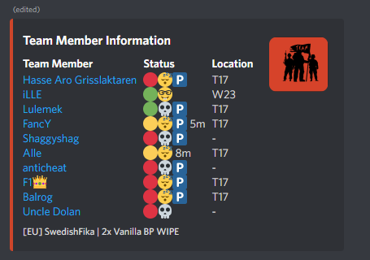

# FCM 자격 증명 설명서

> 봇의 기능을 제대로 사용하려면 FCM 자격 증명을 설정해야 합니다. 이러한 자격 증명을 추가하면 서버를 추가 할 수 있을 뿐만 아니라 연결도 가능합니다.

## FCM 자격 증명 검색

* 다운로드 및 설치 [rustPlusPlus FCM 자격 증명 어플리케이션](https://github.com/alexemanuelol/rustPlusPlus-Credential-Application/releases/download/v1.1.0/rustPlusPlus-1.1.0-win-x64.exe)
* 다운로드 및 설치가 완료되면 앱을 열고 `Connect with Rust+` 버튼을 누릅니다.

* Steam 계정으로 로그인해야 하는 곳에 또 다른 창이 나타납니다.

* 로그인하면 슬래시 명령 /credentials add .....를 표시하는 창이 나타납니다.
* `Copy`를 클릭하여 슬래시 명령어를 복사합니다.

* Discord Server 텍스트 채널에 슬래시 명령어를 붙여넣습니다. 봇이 액세스할 수 있는 한 슬래시 명령을 실행하는 텍스트 채널은 중요하지 않습니다.(rustplusplus 봇이 켜진 상태여야 합니다.)

* 이 프로세스는 봇의 소유자와 자신의 자격 증명을 등록하려는 팀원에게 동일합니다(주로 리더 명령어를 사용을 확장하기 위한 목적으로). 팀원이 자격 증명을 등록한 후에는 게임에 들어가서 서버와 페어링하기만 하면 됩니다. 서버와 페어링한 팀원은 정보 채널에서 볼 수 있으며 이름 옆에 P 아이콘이 있어야 합니다. 아래를 참조하세요.

## FCM 자격 증명이 필요한 이유는 무엇입니까?

다음을 얻으려면 FCM 자격 증명이 필요합니다.

* 서버 페어링 알림
* 스마트 장치 페어링 알림
* 스마트 알람 알림
* 플레이어 오프라인 사망 알림
* 팀원 로그인 알림
* 페이스펀치 뉴스 알림

이것이 없으면 봇이 제대로 작동하지 않습니다.