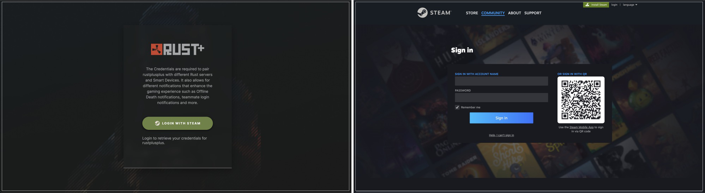
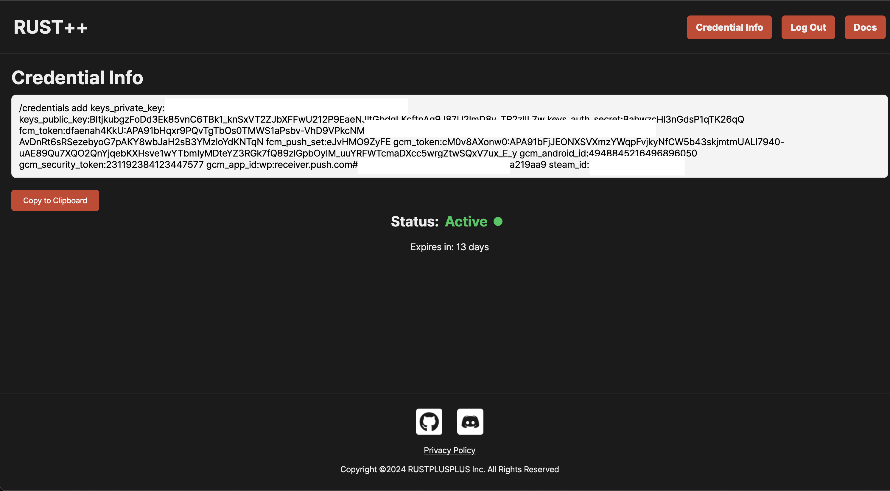
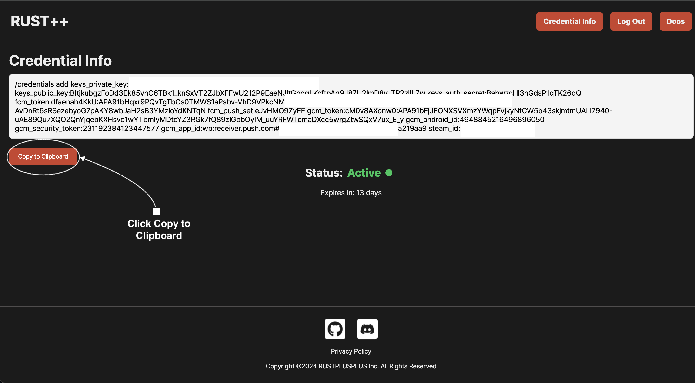
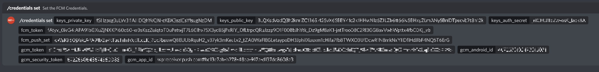
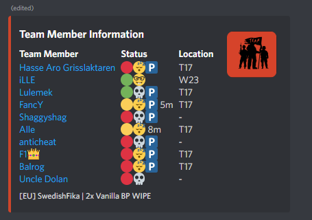

# Credentials Documentation (Web Version)

> To be able to use an instance of the bot properly, you need to set up your Credentials. Adding these credentials makes it possible for you to pair with servers as well as connecting to them. Note that unlike the previous .exe version, the web version requires Chrome or Firefox browsers.

## **❗️Before You Start**
> Make sure you are using **`Chrome or Firefox browsers`** before starting the credential setup process.
> This is because the web version uses browser extensions to simplify the process, which is more lightweight and convenient compared to the relatively heavy .exe application.

## Retrieving Credentials

1. **First, navigate to the [rustplusplus-credentials page](https://rustplusplus-credentials.netlify.app/).**

2. **Click the Install Extension button located at the top right corner of the page to install the extension, then refresh the page. (After installation, the Log In button should be visible)**

> [rustPlusPlus-Credentials Chrome Extension](https://chromewebstore.google.com/detail/rustplusplus-credential-a/ooahmkklkanfgfmphpknpcgdpdcoikhe)

> [rustPlusPlus-Credentials Firefox Extension](https://addons.mozilla.org/en-US/firefox/addon/rustplusplus-credential-app)

   

   

3. **Click the Log In button to proceed with the Steam login.**

   

4. **After logging in, you will be redirected to the display page where the slash command will be shown `/credentials add ....`**

   

5. **Click `Copy` to copy the Slash Command.**

   

6. **Paste the Slash Command in your Discord Server Text Channel. The specific Text Channel does not matter, as long as the bot has access to it.**

   

7. **This process is the same for the owner of the bot as well as any teammate that wants to register their credentials (mainly to extend the usage of the leader command). Once a teammate has registered their credentials, they need to go inside the game and pair with the server. Teammates paired with the server can be seen in the information channel, indicated by the P icon beside their name, as shown below:**

   

## Why are Credentials Necessary?

Credentials are necessary to enable the following features:

* Server Pairing Notifications
* Smart Devices Pairing Notifications
* Smart Alarm Notifications
* Player Offline Death Notifications
* Teammate Login Notifications
* Facepunch News

Without these, the bot would not operate properly.

> **Note**: This process requires Chrome or Firefox browsers for the web version. Ensure your browser is up to date for the best experience.

> Rust Companion API returns a refreshed Steam Auth Token which expires after 2 weeks. You can visit the [rustplusplus-credentials display page](https://rustplusplus-credentials.netlify.app/display) at any time to check how much time is left on your token.
