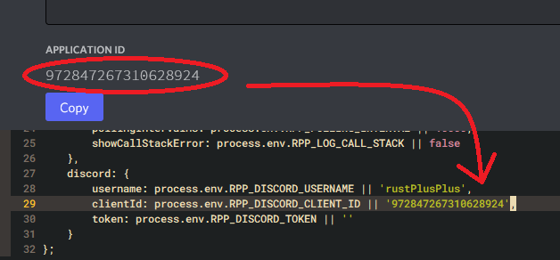
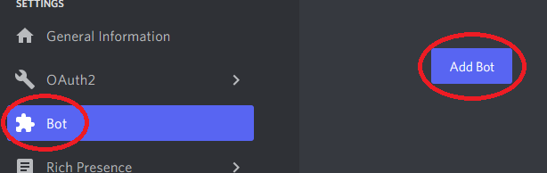
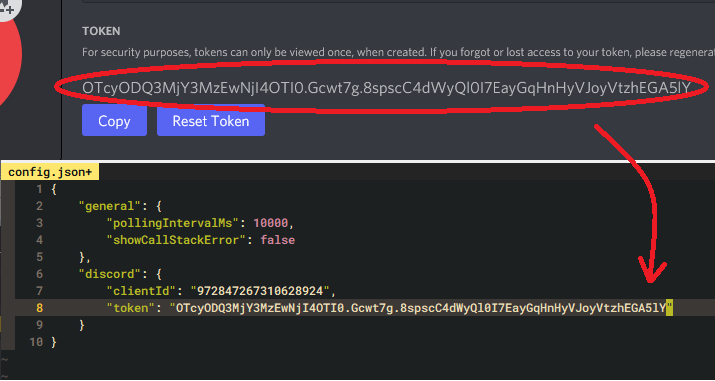
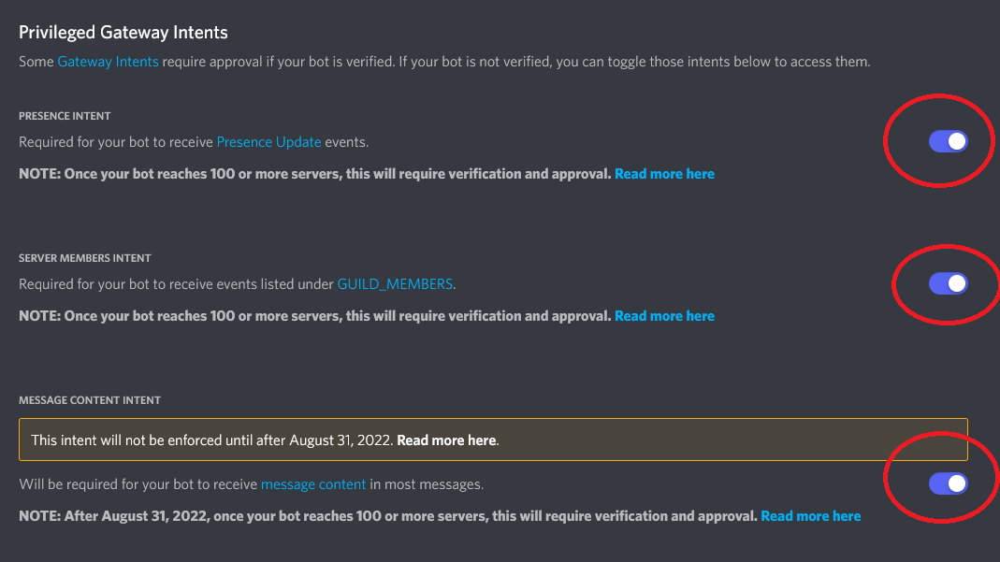
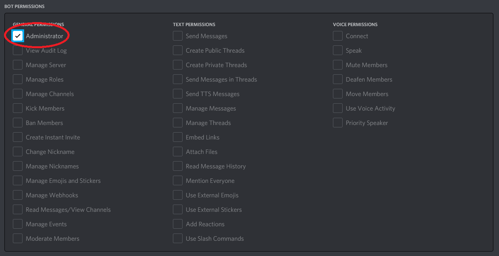
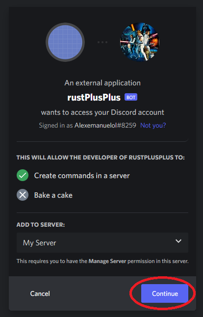

# Discord Bot Setup Documentation

## Create a Discord Bot

1. Go to [`Discord Developers Applications`](https://discord.com/developers/applications).
2. Click on the button `New Application`.

3. Enter the name for the Bot and click `Create`.

4. Copy the `APPLICATION ID` to the config.json file located in repository folder `rustPlusPlus/config.json`.

5. Click on `Bot` and then on `Add Bot`.

6. Click on `Yes, do it!`.

7. Click on `Reset Token` and then `Yes, do it!`.

8. Copy the `TOKEN` to the config.json file located in repository folder `rustPlusPlus/config.json`.

9. Scroll down to `Privileged Gateway Intents` and enable them all.

10. Click on `OAuth2` and then `URL Generator`.

11. Under `SCOPES` select `bot` and `applications.commands`.

12. Under `BOT PERMISSIONS` select `Administrator`.

13. Copy the `GENERATED URL` and paste it into your URL browser.

14. Add the bot to desired Discord Server and click `Continue`.

15. Click on `Authorise`.

16. The Bot should now be visible in your Discord Server.

 
You have now successfully added a Discord Bot with the desired permissions to your Discord Server. You have also added the Application/Client ID and Bot Token to the configuration file of the rustPlusPlus bot repository.