# Discord Bot Setup Documentation

## Create a Discord Bot

1. Go to [`Discord Developers Applications`](https://discord.com/developers/applications).
2. Click on the button `New Application`.

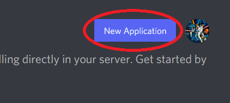

3. Enter the name for the Bot and click `Create`.

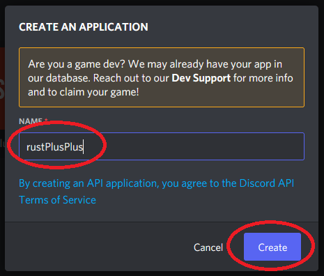

4. Copy the `APPLICATION ID` to the config/index.js file located in repository folder `rustplusplus/config/index.js`.

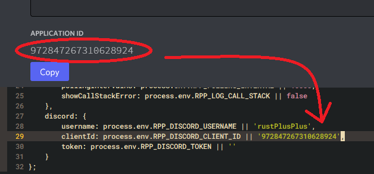

5. Click on `Bot` and then on `Add Bot`.

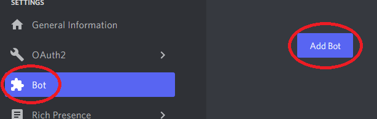

6. Click on `Yes, do it!`.

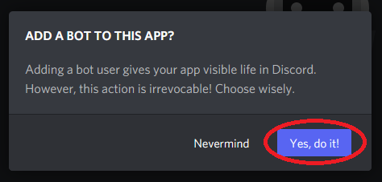

7. Click on `Reset Token` and then `Yes, do it!`.

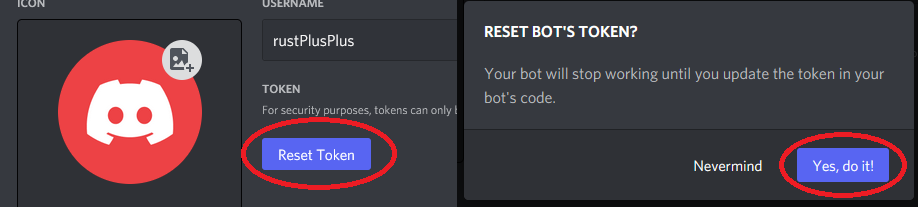

8. Copy the `TOKEN` to the config/index.js file located in repository folder `rustplusplus/config/index.js`.

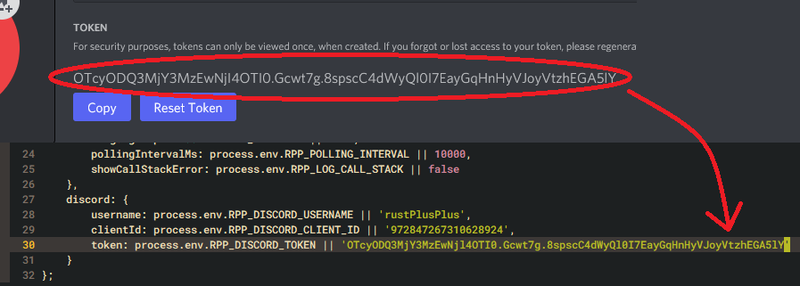

9. Scroll down to `Privileged Gateway Intents` and enable them all.

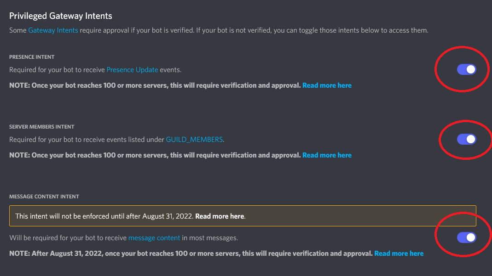

10. Click on `OAuth2` and then `URL Generator`.

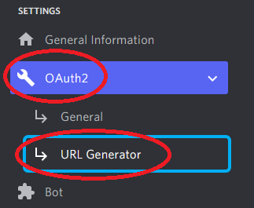

11. Under `SCOPES` select `bot` and `applications.commands`.

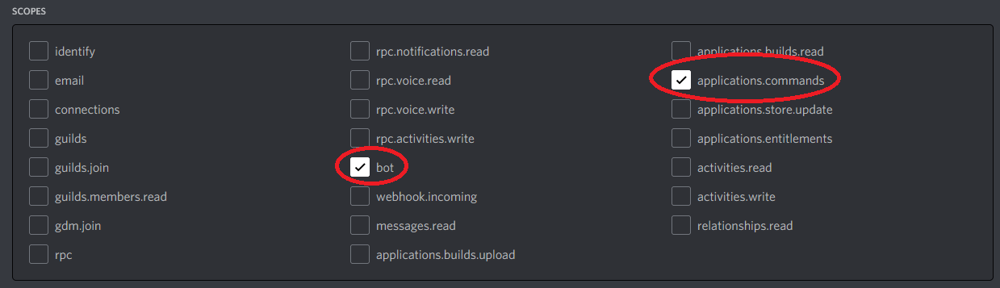

12. Under `BOT PERMISSIONS` select `Administrator`.

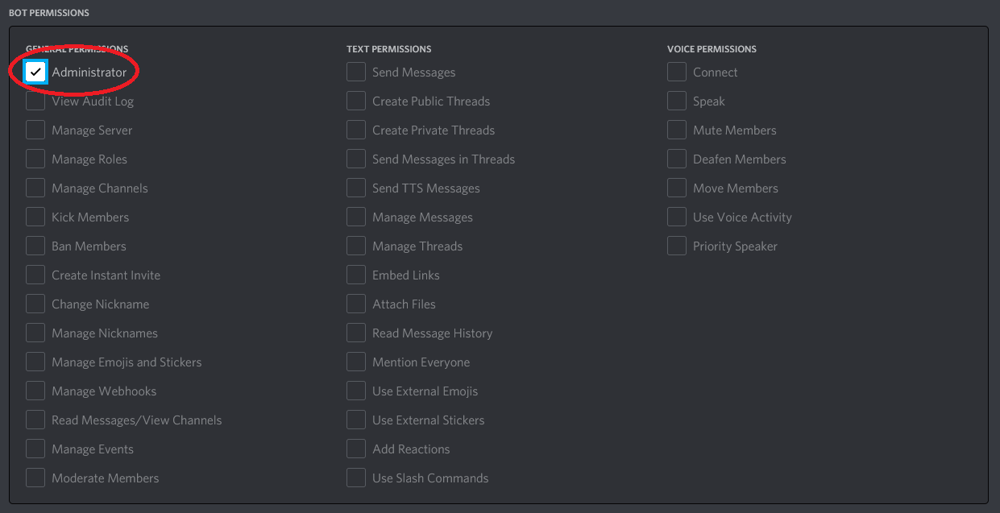

13. Copy the `GENERATED URL` and paste it into your URL browser.

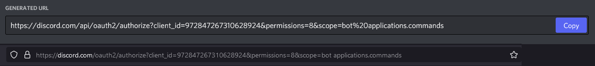

14. Add the bot to desired Discord Server and click `Continue`.

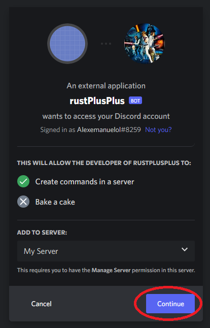

15. Click on `Authorise`.

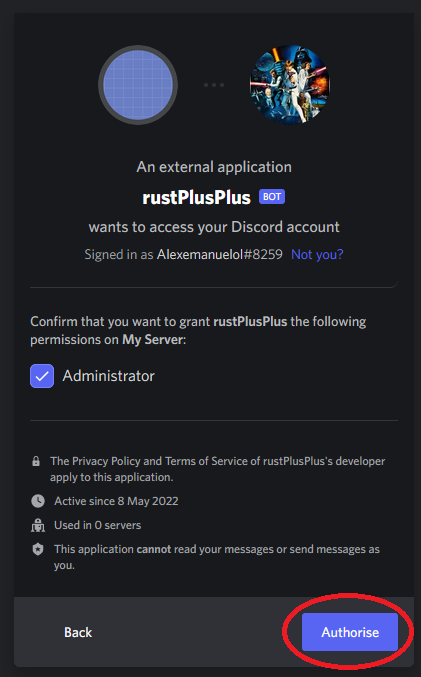

16. The Bot should now be visible in your Discord Server.

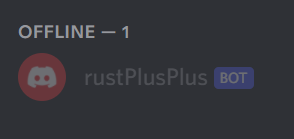

17. Start the bot by running `npm start run` in the terminal (First time running the bot will create all of the missing discord text channels).

 
You have now successfully added a Discord Bot with the desired permissions to your Discord Server. You have also added the Application/Client ID and Bot Token to the configuration file as well as started the bot for the first time.