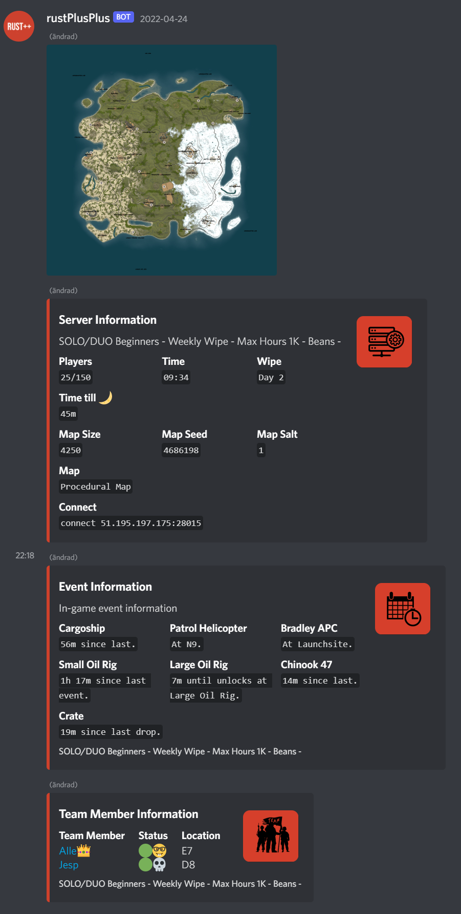
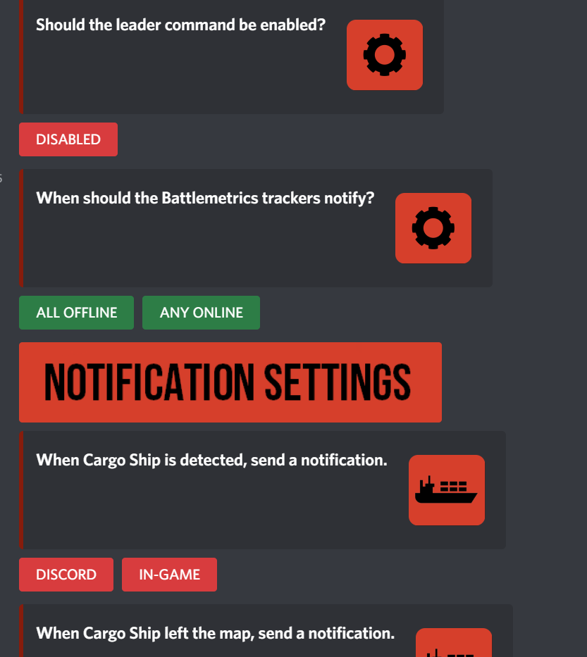
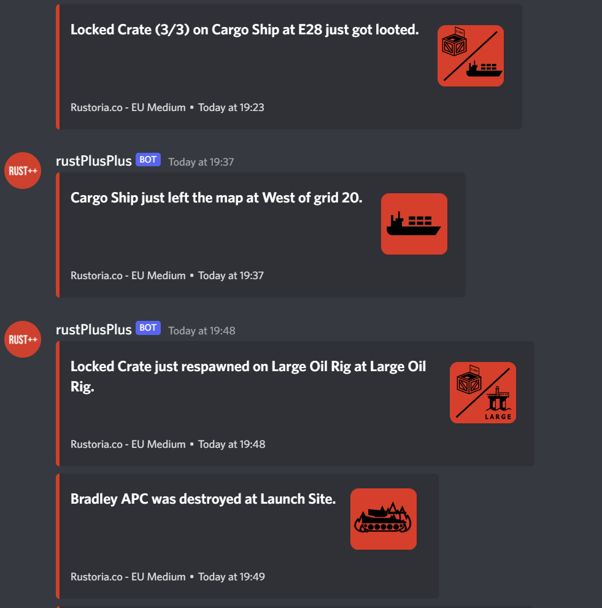
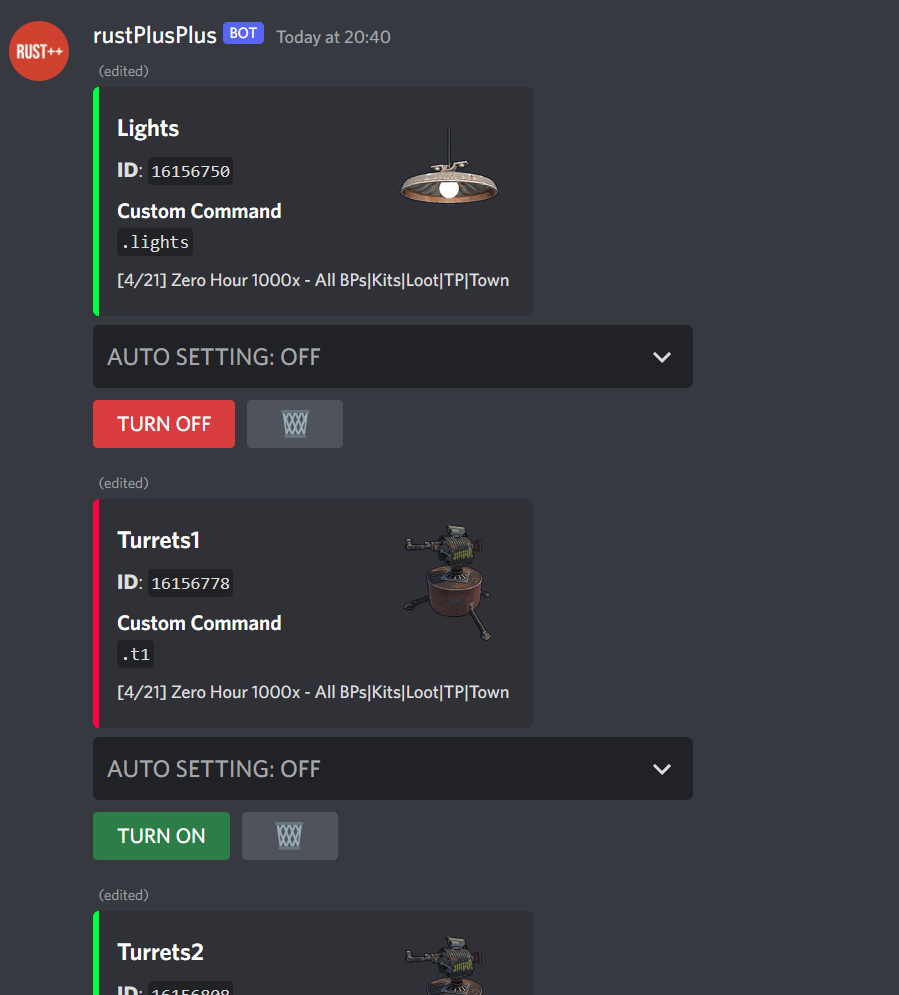
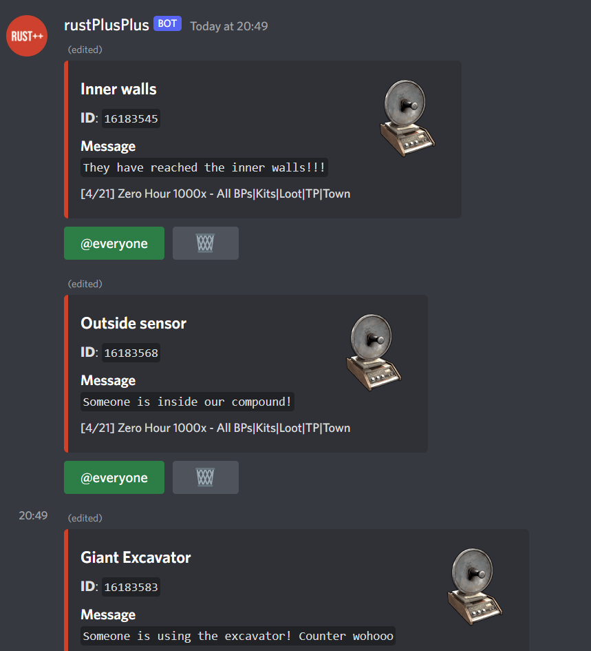
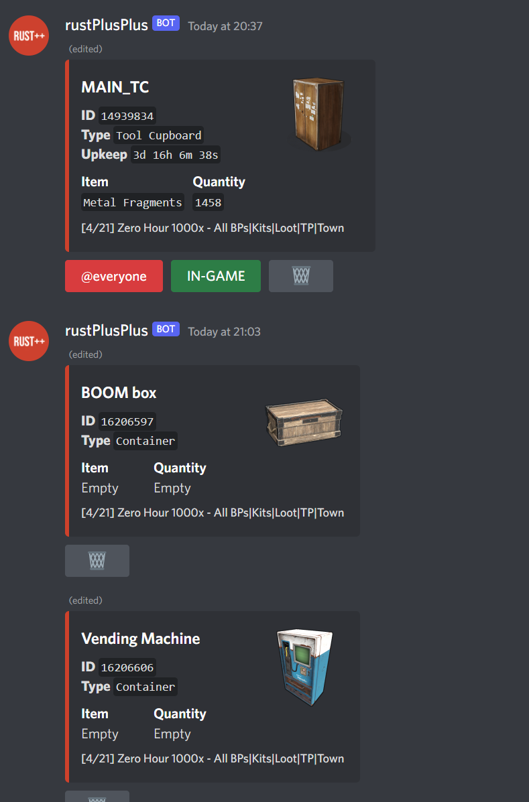
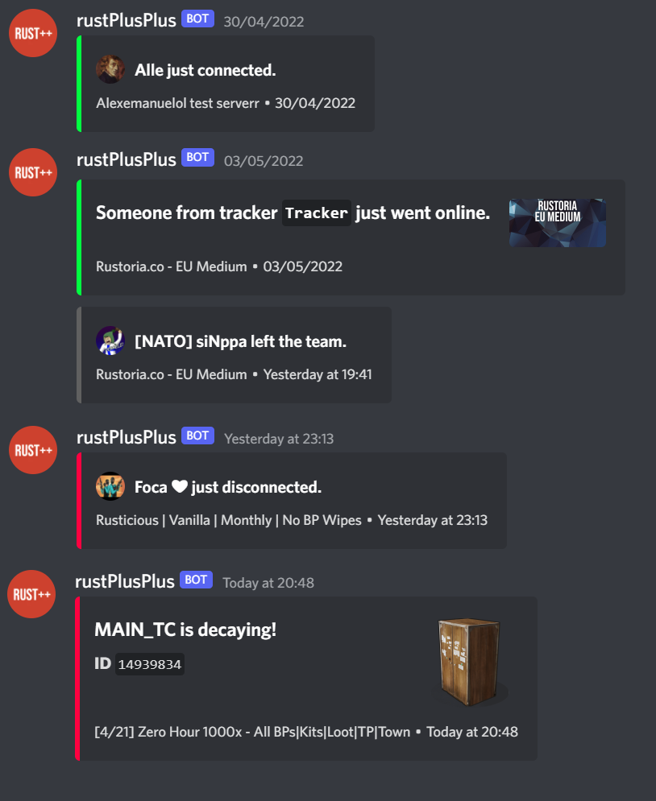
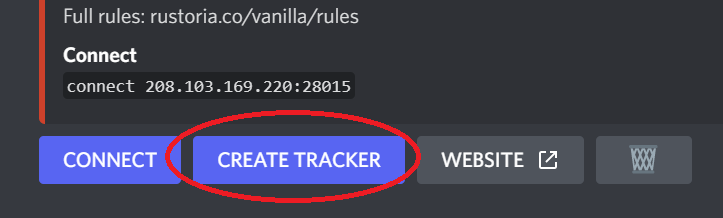
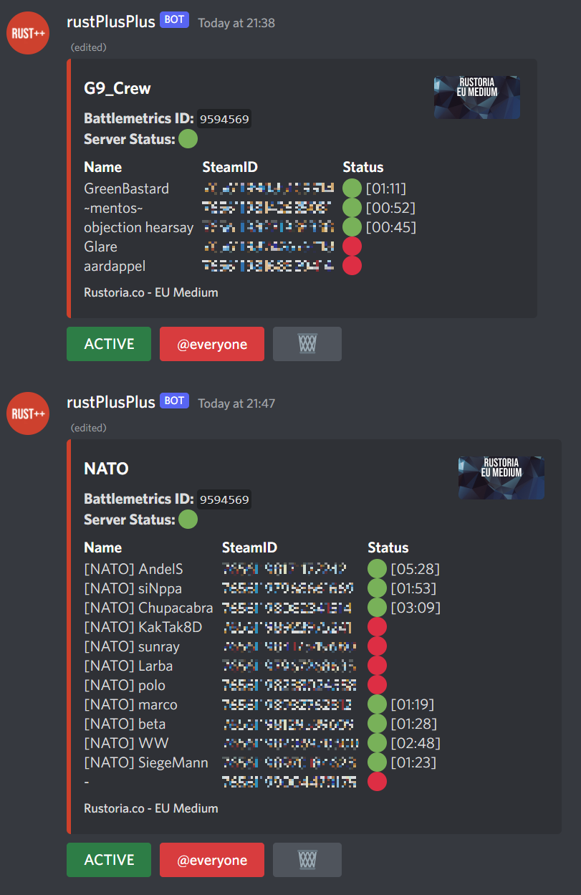

# Discord Text Channels Documentation

## Discord Text Channels

* [**Information**](discord_text_channels.md#information-channel)
* [**Servers**](discord_text_channels.md#servers-channel)
* [**Settings**](discord_text_channels.md#settings-channel)
* [**Events**](discord_text_channels.md#events-channel)
* [**Teamchat**](discord_text_channels.md#teamchat-channel)
* [**Switches**](discord_text_channels.md#switches-channel)
* [**Alarms**](discord_text_channels.md#alarms-channel)
* [**Storagemonitors**](discord_text_channels.md#storagemonitors-channel)
* [**Activity**](discord_text_channels.md#activity-channel)
* [**Trackers**](discord_text_channels.md#trackers-channel)

## Information Channel

> The Information Channel present information about the currently connected Rust Server. It is split up into four sections, the map, server information, event information and team information.

### The map

Displays the map of the Rust Server.

### Server Information

Displays player population, current time and time till daylight/nightfall, wipe day, map size, map seed, map salt, name of the map and connect information.

### Event Information

Displays events such as Cargoship, Patrol Helicopter, Bradley APC, Small/ Large Oil Rig, Chinook 47 and Locked Crates.

### Team Member Information

Displays information about teammates, what their current status is (online/offline/afk/dead) and their location.

## Servers Channel

> The Server Channel lists all the paired Rust Servers. Given that you have setup your FCM Credentials properly, once you pair a server in-game via `ESC -> Rust+ -> Pair With Server`, it should automatically appear in the servers channel. From there you can decide which server you want the bot to connect to by clicking the `CONNECT` button for that server.

## Settings Channel

> The Settings Channel contain a bunch of different settings for the bot. There are settings for prefix, trademark visibility, allow in-game commands, Smart Alarm notifications, enable leader command, battlemetrics notifications and event notification settings.

## Events Channel

> The Events Channel contains all the event notifications that occur such as:
 - `Cargoship spawn`
 - `Cargoship despawn`
 - `Cargoship enters egress stage`
 - `Patrol Helicopter spawn`
 - `Patrol Helicopter despawn`
 - `Patrol Helicopter destroyed`
 - `Bradley APC destroyed`
 - `Bradley APC should respawn`
 - `Locked Crate spawn`
 - `Locked Crate despawn`
 - `Locked Crate despawn warning`
 - `Oil Rig have been triggered`
 - `Chinook 47 spawn`
 - `New Vending Machine detected`

## Teamchat Channel

> The Teamchat Channel is where you communicate with your teammates In-Game. Whatever you type in the text channel will appear In-Game as well and vice versa.

## Switches Channel

> The Switches Channel lists all the paired Smart Switches. Given that you have setup your FCM Credentials properly, once you pair a Smart Switch in-game by `using a wiretool`, it should automatically appear in the switches channel. From there you can turn the switch ON/OFF, edit the AUTO setting or remove it. You can also use the /switch Slash Command to edit the name, command and image of the Smart Switch.

## Alarms Channel

> The Alarms Channel lists all the paired Smart Alarms. Given that you have setup your FCM Credentials properly, once you pair a Smart Alarm in-game by `using a wiretool`, it should automatically appear in the alarms channel. From there you can enable if it should notify `@everyone` when triggered or remove it. You can also use the /alarm Slash Command to edit the name, message and image of the Smart Alarm.

## Storagemonitors Channel

> The Storagemonitors Channel lists all the paired Storage Monitors. Given that you have setup your FCM Credentials properly, once you pair a Storage Monitor in-game by `using a wiretool`, it should automatically appear in the storagemonitors channel. Depending on if you've placed the Storage Monitor on a Tool cupboard or Large Wooden Box/Vending Machine, they work differently. For Tool Cupboards you can select if you want it to notify @everyone when it starts to decay or cannot be found. You can also decide if the notification should be forwarded in teamchat in-game. For Large Wooden Box and Vending Machines, you are able to view the content inside it via discord. There is also a useful recycle command that you can use to calculate the expected output of recycling everything in a container (`/storagemonitors recycle`). You can also use the /storagemonitor Slash Command to edit the name and image of the Storage Monitor.

## Activity Channel

> The Activity Channel is used to display a bunch of different things such as team member joined/ left/ connected/ disconnected/ offline killed, Not found notifications from Smart Devices, Smart Alarm notifications, Decaying notifications, Tracker information, Server went down/up notifications, facepunch news etc...

## Trackers Channel

> The Trackers Channel is used to keep track of players or groups on a specific server (Online/Offline/playtime). Given that the server does not use `Streamer mode`, it is possible to create a tracker from the server embed located in the servers channel. By clicking `CREATE TRACKER`, a new tracker appears in the trackers channel. From there you can use the /tracker Slash Command to edit the name of the tracker as well as adding players or removing them by steamId.

