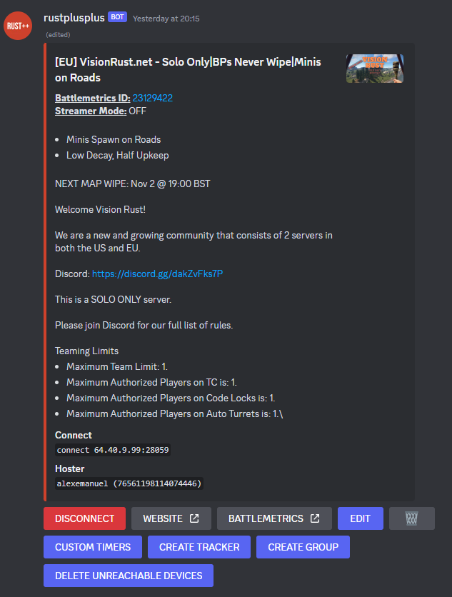
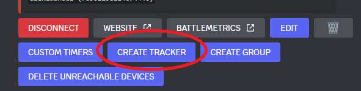
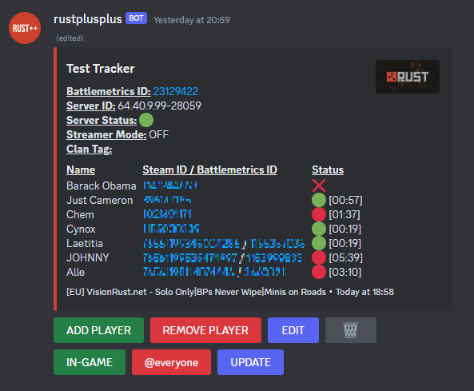

# Discord Text Channels Documentation

## Discord Text Channels

* [**Information**](discord_text_channels.md#information-channel)
* [**Servers**](discord_text_channels.md#servers-channel)
* [**Settings**](discord_text_channels.md#settings-channel)
* [**Commands**](discord_text_channels.md#commands-channel)
* [**Events**](discord_text_channels.md#events-channel)
* [**Teamchat**](discord_text_channels.md#teamchat-channel)
* [**Switches**](discord_text_channels.md#switches-channel)
* [**Switchgroups**](discord_text_channels.md#switch-groups-channel)
* [**Alarms**](discord_text_channels.md#alarms-channel)
* [**Storagemonitors**](discord_text_channels.md#storagemonitors-channel)
* [**Activity**](discord_text_channels.md#activity-channel)
* [**Trackers**](discord_text_channels.md#trackers-channel)

## Information Channel

> The Information Channel present information about the currently connected Rust Server. It is split up into four sections, `The Map`, `Server Information`, `Event Information` and `Team Member Information` (See below).

**The Map** is simple an image of the Rust Server Map.
 

**Server Information** is just that, information about the server such as:
- Players currently online
- Time In-Game
- How long ago Map Wipe was
- Time till day/night
- Map Size
- Map Seed
- Map Salt
- Map Name
- Connect information for join through In-Game console
 

**Event Information** shows event activities In-Game such as:
- Cargoship
- Patrol Helicopter
- Small Oil Rig
- Large Oil Rig
- Chinookk 47
 

**Team Member Information** shows the entire team. Whos online/offline/afk/alive/dead, location, leader and paired.

**Battlemetrics Online Players** shows all online players on the server.

## Servers Channel

> The Server Channel lists all the paired Rust Servers. Given that you have setup your Credentials properly, once you pair a Rust Server In-Game via `ESC -> Rust+ -> Pair With Server`, it should automatically appear in the `servers` channel. From there you can decide which server you want the bot to connect to by clicking the `CONNECT` button for that server.

The server embed displays a bunch of information. The title of the embed is the name of the server. The Battlemetrics Id is also displayed as well as if the server is streamer mode or not. The Description of the embed is basically the description of the Rust Server. Here you can also find the connect information that could be found in `information` channel. You can also see who is the hoster of the bot for the server.
 

There are a few buttons for each server. The `CONNECT` button lets you start a connection to the server. Once connected you can disconnect by clicking the `DISCONNECT` button. By clicking the `WEBSITE` button, you will be re-directed to the Rust Servers website. By clicking the `BATTLEMETRICS` button, you will be re-directed to the Battlemetrics page for the Rust Server. By clicking the `EDIT` button, you can change the `Battlemetrics Id` for the server. By clicking the `CUSTOM TIMERS` button, you can change Custom Timers for Cargoship egress time and time before a Locked Crate at Oil Rig is unlocked. By clicking the `CREATE TRACKER` button, you create a battlemetrics tracker that will appear in the `trackers` Text-Channel on Discord. By clicking the `CREATE GROUP` button, you create a Smart Switch Group that can be used to manage several Smart Switches at once. The Smart Switch Group will appear in the `switchgroups` Text-Channel on Discord. To remove the Server, just click the trashcan button.

## Settings Channel

> The Settings Channel contain a bunch of different settings for rustplusplus. There are settings for language, voice gender, command prefix, trademark visibility, allow in-game commands, mute in-game, in-game teammate notifications, command delay, Smart Alarm notifications, enable leader command, battlemetrics notifications, wipe detection, vending machine subscription and event notifications.

## Commands Channel

> The Commands Channel allows you to run In-Game Commands straight from Discord.

## Events Channel

> The Events Channel contains all the event notifications that occurs such as:

- `Cargoship spawn`
- `Cargoship despawn`
- `Cargoship enters egress stage`
- `Patrol Helicopter spawn`
- `Patrol Helicopter despawn`
- `Patrol Helicopter destroyed`
- `Locked Crate at Oil Rig Unlocked`
- `Oil Rig have been triggered`
- `Chinook 47 spawn`
- `New Vending Machine detected`

## Teamchat Channel

> The Teamchat Channel makes it possible to communicate with your teammates In-Game. What you write in `teamchat` Channel appears In-Game and whatever you write In-Game appears in the `teamchat` Channel.

## Switches Channel

> The Switches Channel lists all the paired Smart Switches. See [Smart Devices](smart_devices.md#smart-switches).

## Switch Groups Channel

> The Switch Groups Channel lists all groups of Smart Switches. See [Smart Devices](smart_devices.md#smart-switch-groups).

## Alarms Channel

> The Alarms Channel lists all the paired Smart Alarms. See [Smart Devices](smart_devices.md#smart-alarms).

## Storagemonitors Channel

> The Storagemonitors Channel lists all the paired Storage Monitors. See [Smart Devices](smart_devices.md#storage-monitors).

## Activity Channel

> The Activity Channel is used to display a bunch of different things such as team member joined/ left/ connected/ disconnected/ killed/ offline killed, Not found notifications from Smart Devices, Smart Alarm notifications, Decaying notifications, Tracker information, Server went down/up notifications, facepunch news, Battlemetrics notifications etc...

## Trackers Channel

> The Trackers Channel is used to keep track of players or groups on a specific server (Online/Offline/playtime/offlinetime). To create a tracker, just click on the `CREATE TRACKER` button located in the `servers` channel. The new tracker will appear in the trackers channel.

The Tracker embed displays a few things. The Title of the embed is the name of the Tracker. The Tracker embed also displays the Battlemetrics Id of the tracker, the Server ID, Server status, streamer mode on/off and potential Clan Tag setting. Under that, all players in the tracker are displayed. The `Names`, `Steam ID / Battlemetrics ID` and `Status` of every player.
 

By clicking the `ADD PLAYER` button, you can add a player to the tracker by providing the steamId or battlemetrics player id. By clicking the `REMOVE PLAYER` button, you can remove a player from the tracker by providing the steamId or battlemetrics player id. To make the tracker more accurate and make it easier to detect name changes, we recommend using steamID for the tracker. By clicking the `EDIT` button, you can change the `Name` of the tracker, the `Battlemetrics Id` of the tracker and the `Clan Tag` for all the players in the tracker. To remove the tracker, click the trashcan button. By clicking the `IN-GAME` button, you let the tracker notify in teamchat. By clicking the `@everyone` button, you decide if the @everyone tag should be used whenever a person connect/disconnect.

