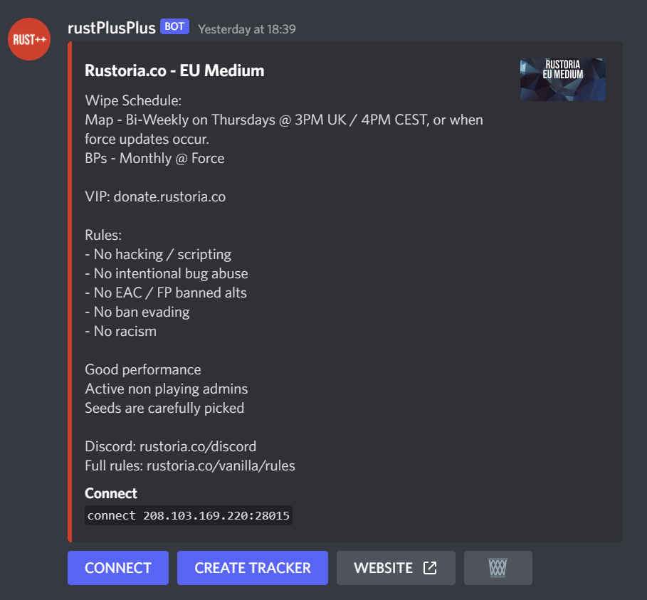

# Pair and Connect to a Server

1. Make sure that you've setup the FCM Credentials and that the bot is currently running (`npm start run`).
2. Login to the Rust server you want to play.
3. Click `ESC` and then on `Rust+`.
4. Click `PAIR WITH SERVER`.

5. When you've paired the server it should appear in the Discord Text Channel `servers`.

6. From there, you just click the `CONNECT` button and the bot will connect to the Rust server.
