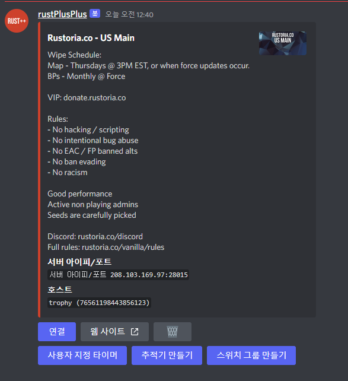

# 서버 페어링 및 연결

1. FCM 자격 증명을 설정했고 봇이 현재 실행 중인지 확인합니다(`npm start run`).
2. 플레이하려는 러스트 서버에 로그인하세요.
3. `ESC`를 클릭한 다음 `Rust+`를 클릭합니다.
4. `PAIR WITH SERVER`를 클릭하세요.

5. 서버를 페어링하면 Discord 텍스트 채널 `servers`에 나타납니다.

6. 거기에서 `연결` 버튼을 클릭하면 봇이 Rust 서버에 연결됩니다.
