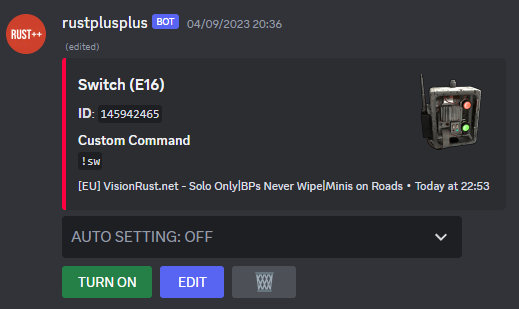
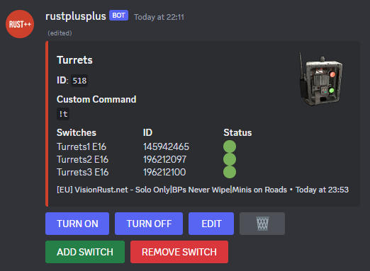
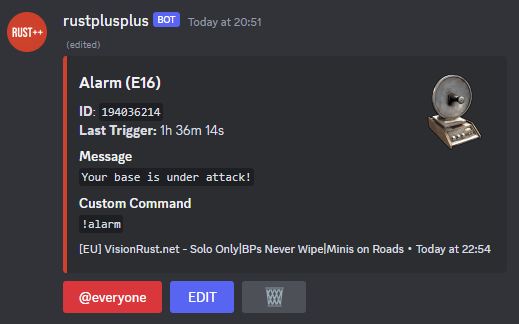
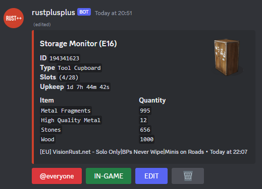
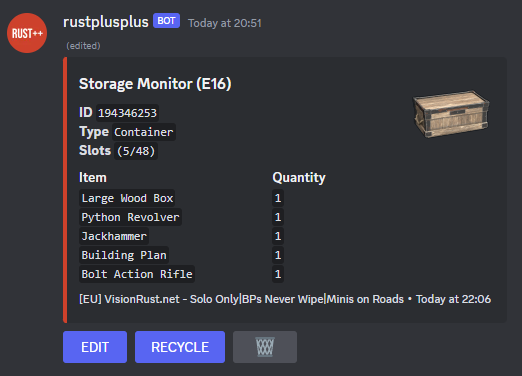
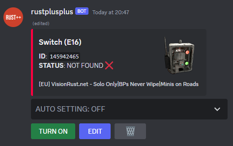

# Smart Devices

> Smart Devices is an umbrella term for three different devices, `Smart Switches`, `Smart Alarms` and `Storage Monitors`. To pair a Smart Device with rustplusplus, make sure you've [setup the Credentials](credentials.md). When the Credentials are setup, you just need a `wire tool` and start pairing like you would with the [Rust+ Companion App](https://rust.facepunch.com/companion). Once you've paired your Smart Devices, they should appear in their respective Discord Text-Channel (`switches`, `alarms` or `storagemonitors`).
 

It is possible to change the display image for all the different Smart Devices by running the corresponding Slash Command. The Slash Commands to change Smart Device images is `/switch`, `/alarm` and `/storagemonitor`.

## Smart Switches
> Paired Smart Switches can be located in the `switches` Text-Channel on Discord. Only Smart Switches from the currently/last connected Rust server will be shown in the channel.

The image above is what a paired Smart Switch looks like in Discord. In this case the Smart Switch is called `Switch` and is located at E16. All Smart Devices have an Entity Id which is used to identify it. The Custom Command for this switch is `!sw` which can be used from the in-game teamchat.
  
The Smart Switch can be turned ON/OFF by clicking the `TURN ON` / `TURN OFF` button at the bottom. By clicking on the `EDIT` button, you can edit things such as the `Name` and the `Custom Command` for the Smart Switch. If the `AUTO SETTING` is set to either `AUTO-ON-PROXIMITY` or `AUTO-OFF-PROXIMITY`, there will be a proximity setting available to edit. The proximity setting is used to turn the switch ON/OFF when a teammate is within the proximity of the Smart Switch. To remove the Smart Switch, just click the trashcan button.
  
There are a few auto settings for Smart Switches:
- **OFF** - Smart Switch work as normal.
- **AUTO-DAY** - Smart Switch will be active only during the day.
- **AUTO-NIGHT** - Smart Switch will be active only during the night.
- **AUTO-ON** - Smart Switch will automatically go active during update cycle.
- **AUTO-OFF** - Smart Switch will automatically go inactive during update cycle.
- **AUTO-ON-PROXIMITY** - Smart Switch will automatically go active if teammate is in proximity, if outside proximity it will go inactive.
- **AUTO-OFF-PROXIMITY** - Smart Switch will automatically go inactive if teammate is in proximity, if outside proximity it will go active.
- **AUTO-ON-ANY-ONLINE** - Smart Switch will automatically go active if any teammate is online, if all offline it will go inactive.
- **AUTO-OFF-ANY-ONLINE** - Smart Switch will automatically go inactive if any teammate is online, if all offline it will go active.

 

Smart Switches can also be controlled from within the game through teamchat via custom commands. Custom command call combinations for the Smart Switch `Switch` are shown below:
* **!sw** - To toggle the switch.
* **!sw 60s** - To toggle the switch and then toggle it back after 60 seconds.
* **!sw on** - To turn the switch ON.
* **!sw off** - To turn the switch OFF.
* **!sw on 60s** - To turn the switch ON and automatically turn it OFF after 60 seconds.
* **!sw off 60s** - To turn the switch OFF and automatically turn it ON after 60 seconds.
* **!sw status** - To get the current status of the switch.

### Smart Switch Groups
> Smart Switch Groups is a feature that allows you to control multiple Smart Switches at once. The image below is what a Smart Switch Group looks like in Discord.

To create a Smart Switch Group, click the `CREATE GROUP` button located under appropriate server in the `servers` Text-Channel on Discord. This will create the Smart Switch Group embed above located in the `switchgroups` Text-Channel on Discord. The Group above is called `Turrets` and have the entity id `518`. The Custom Command for this group is `!t` and the Group have three Smart Switches connected to it.
  
The Smart Switch Group can be turned ON/OFF by clicking the `TURN ON` / `TURN OFF` button at the bottom. By clicking on the `EDIT` button, you can edit things such as the `Name` and the `Custom Command` for the Smart Switch Group. To add a Smart Switch to the Group you click the `ADD SWITCH` button and if you want to remove a Smart Switch from the Group you click the `REMOVE SWITCH` button. You provide the entity id of the Smart Switch you want to add/remove. To remove the Smart Switch Group, just click the trashcan button.

 

Smart Switch Groups can also be controlled from within the game through teamchat via custom commands. Custom command call combinations for the Smart Switch Group `Turrets` are shown below:
* **!t on** - To turn all the switches in the group ON.
* **!t off** - To turn all the switches in the group OFF.
* **!t on 60s** - To turn all the switches in the group ON and automatically turn them OFF after 60 seconds.
* **!t off 60s** - To turn all the switches in the group OFF and automatically turn them ON after 60 seconds.
* **!t status** - To get status of all Smart Switches in the group.

## Smart Alarms
> Paired Smart Alarms can be located in the `alarms` Text-Channel on Discord. All Smart Alarms from all servers will be shown in the channel.

The image above is what a paired Smart Alarm looks like in Discord. In this case the Smart Alarm is called `Alarm` and is located at E16. All Smart Devices have an Entity Id which is used to identify it. From the `Last Trigger` you can see when the Smart Alarm was last triggered. Under `Message` you can see the Message is that will be broadcast when the Smart Alarm gets triggered. The Custom Command for this alarm is `!alarm` which can be used from the in-game teamchat. The Custom Command will tell you when it was last triggered.
  
By clicking the `@everyone` button you decide if the @everyone tag should be used in Discord when the Smart Alarm gets triggered. By clicking on the `EDIT` button, you can edit things such as the `Name`, `Message` and the `Custom Command` for the Smart Alarm. To remove the Smart Alarm, just click the trashcan button.
  
There are a few more settings for Smart Alarms that can be found in the `settings` channel. The first one lets you decide if Smart Alarms that are not part of the currently connected server still should notify when triggered. The second one lets you decide if Smart Alarms should notify In-Game when triggered.

## Storage Monitors
> Paired Storage Monitors can be located in the `storagemonitors` Text-Channel on Discord. Only Storage Monitors from the currently/last connected Rust server will be shown in the channel.

The images above is what paired Storage Monitors looks like in Discord. There are three types of Storage Monitors depending on where you place them. The first one is of type `Tool Cupboard` and works almost like the second and third type `Large Wood Box` and `Vending Machine` but with the difference that it shows upkeep. In both cases the `Name` of the Storage Monitors is `Storage Monitor` and can be located at E16. All Smart Devices have an Entity Id which is used to identify it. It also shows how many slots the Storage Monitor has and how many of them are occupied. Lastly the Storage Monitor shows the content inside it, the items and quantity.
  
Tool Cupboard type Storage Monitor have the `@everyone` button that lets you decide if @everyone tag should be used in Discord when the Tool Cupboard starts to decay. By clicking on the `IN-GAME` button, you decide if decay notifications should be made In-Game as well.
  
Container type Storage Monitor have the `RECYCLE` button which lets you calculate what resources you would get if you recycled the content of the container.
  
By clicking on the `EDIT` button, you can edit the `Name` of the Storage Monitor. To remove the Storage Monitor, just click the trashcan button.

## Unreachable Smart Devices
> When a Smart Devices gets removed, the hoster loses building privilege to the Smart Device or rustplusplus just don't get a response from pinging it, the device is unreachable. In the image below you can see the Smart Switch `Switch` can no longer be reached. In this case its because of a force wipe, The Smart Switch does no longer exist. If the Smart Device is unreachable because the hoster lost building privilege, gaining building privilege again will make the device reachable again. But if the Smart Device was removed from where it was placed you might as well remove it from Discord, once a Smart Device gets removed the Entity Id is invalid. Even if you place the same Smart Device, the Entity Id will be different.

